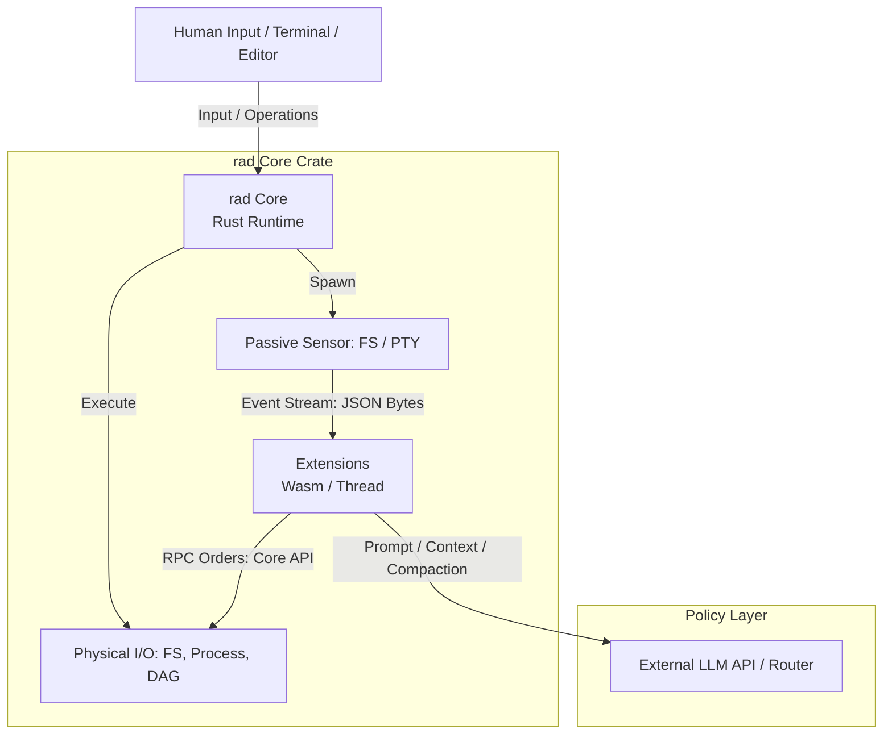
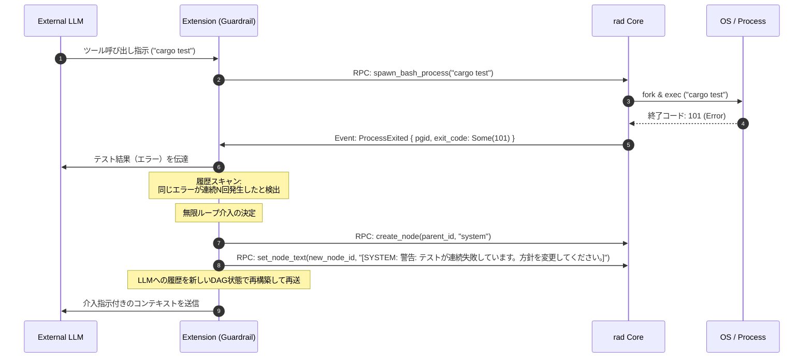
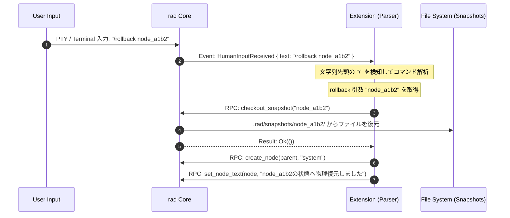

# `rad` (Rust Agent Dispatcher) アーキテクチャ設計仕様書

本ドキュメントは、Rust言語で記述された低レイヤランタイム「コア（Core / rad）」と、WebAssembly（Wasm）または独立スレッドとして動作する「エクステンション（Extension）」から構成される自律エージェント基盤 `rad` のアーキテクチャ設計仕様を定義します。

---

## 1. システムトポロジーと制御の分離 (System Topology & Isolation)

`rad` は、OSレベルの特権的操作や物理実行を担う**「メカニズム層」**と、LLMの文脈解釈やエージェントの行動決定を行う**「ポリシー層」**を完全に分離した2層構造を採用しています。



### 1.1 コア（rad）の責務：メカニズム層
コアは、OS、ファイルシステム、ネットワークストリームに対する低レイヤ物理操作（プリミティブ）の実行、および各サブシステムからの物理イベントの検知・分配（Dispatch）に特化します。
* **状態の非保持性**: プロンプト、対話履歴、モデルの意図や思考内容など、セマンティクスに関わる論理状態を一切保持せず、解釈も行いません。
* **イベント駆動**: コア内部のセンサー（ファイルシステム監視、PTY状態など）が変化を捉えた際、即座に生イベント（JSON）としてエクステンションに流します。

### 1.2 エクステンションの責務：ポリシー層
エクステンションは、コアから送信されるイベントストリームを購読し、すべての論理的な制御判断を行います。
* **対話・思考コンテキストの構築**: LLMへ送信する履歴（コンテキスト）の管理。
* **安全弁（ガードレール）の適用**: コマンド実行やファイル編集前の安全確認。
* **コンパクション（文脈圧縮）**: トークン制限を超えないための要約や履歴削減。
* **スナップショット制御**: どのチェックポイントで状態を退避・復元するかのポリシー決定。

---

## 2. 状態（State）およびサブシステム仕様

コアは内部の各サブシステムを通じて物理的状態を追跡・計測し、変動検知時に生イベントを放流します。

### 2.1 追跡対象の状態 (Tracked States)

1. **LLMストリーム状態 (Network Subsystem)**
   * **追跡データ**: 最後に1バイト（1トークン）を受信した物理時刻（ミリ秒精度スタンプ）、および接続ステータス（`Connecting`, `Streaming`, `Closed`, `Aborted`）。
   * **イベント**: ネットワークパケットの着信、接続断、タイムアウト発生。
2. **プロセス状態 (Process Subsystem)**
   * **追跡データ**: コアが生成した外部プロセスのプロセスグループID（PGID）リスト、各PGIDの標準出入力（`stdout`/`stderr`）の最終アクティビティ時刻、およびOSの終了コード（`ExitStatus`）。
   * **イベント**: プロセス起動、出力データの受信、プロセス終了。
3. **ファイルシステム状態 (FS Subsystem)**
   * **追跡データ**: ワークスペース内のファイルの追加・変更・削除イベント（Rustの `notify` クレート等を利用）、および `.rad/snapshots/` 内のスナップショットインデックス。
   * **イベント**: ファイルシステム上の物理的変化。
4. **グラフ状態 (DAG Subsystem)**
   * **追跡データ**: セッション履歴（LLMの思考パス、ユーザー指示、ツール実行結果など）を保持する有向非巡回グラフ（Directed Acyclic Graph）のトポロジー、および現在のカレントノード識別子。
   * **イベント**: ノードの作成・編集・削除、カレントノードの移動。

### 2.2 動的タイムアウト制御 (Dynamic Timeout)

思考トークンをストリーミング出力しない長考モデルや、内部思考中に応答が長時間途絶えるモデルへの対応として、ストリーム監視タイマーの基準値はエクステンションからのRPC命令によって動的に書き換え可能です。

* **`heartbeat_timeout_ms`**: ストリーミング時におけるパケット間隔の最大許容時間。トークンが一定時間届かない場合にタイムアウトイベントを発生させます。
* **`max_silent_wait_ms`**: 非ストリーミング長考モデル（推論完了後に一括出力するモデルなど）の応答を待つための最大沈黙猶予時間。

---

## 3. データ構造とインターフェース定義 (Data Structures & IPC)

コアとエクステンション間の境界を越える通信は、すべて JSON フォーマットにシリアライズされ、Wasm 境界またはスレッド間チャンネルを介して送受信されます。

### 3.1 コア → エクステンション イベントストリーム (`RasCoreEvent`)

コアが検知した物理イベントは、以下の enum をシリアライズしてエクステンションに送られます。

```rust
use serde::{Deserialize, Serialize};
use std::path::PathBuf;

#[derive(Debug, Clone, Serialize, Deserialize)]
#[serde(tag = "type", content = "payload")]
pub enum RasCoreEvent {
    // === LLM通信関連 ===
    /// LLMからトークン（または一部の文字列）を受信した
    TokenReceived {
        token: String,
    },
    /// LLMからツール実行の要求が発生した
    ToolCallRequested {
        call_id: String,
        name: String,
        args: serde_json::Value,
    },

    // === プロセス監視関連 (PTY / Bash) ===
    /// プロセスグループが生成された
    ProcessSpawned {
        pgid: i32,
        pid: i32,
    },
    /// プロセスグループの標準出力からデータを受信した
    ProcessStdout {
        pgid: i32,
        #[serde(with = "serde_bytes")]
        data: Vec<u8>,
    },
    /// プロセスグループの標準エラー出力からデータを受信した
    ProcessStderr {
        pgid: i32,
        #[serde(with = "serde_bytes")]
        data: Vec<u8>,
    },
    /// プロセスグループのメインプロセスが終了した
    ProcessExited {
        pgid: i32,
        exit_code: Option<i32>,
    },

    // === パッシブセンサー ＆ 例外検知 ===
    /// ワークスペース内のファイルが変更された
    FileChanged {
        path: PathBuf,
        change_type: String, // "create" | "modify" | "remove"
    },
    /// 指定ターゲットでのタイムアウトが発生した
    StreamTimeout {
        target: String, // "llm" | "process_<pgid>"
        duration_ms: u64,
    },
    /// ユーザー（人間）からの入力行を受信した
    HumanInputReceived {
        text: String,
    },
}
```

### 3.2 エクステンション → コア 制御RPC (`RasExtensionFacingApi`)

エクステンションからコアに対して、物理操作を命令するためのインターフェース定義です。

```rust
use std::collections::HashMap;
use std::path::{Path, PathBuf};

pub type StreamId = String;

#[derive(Debug, Clone, Serialize, Deserialize)]
pub enum Target {
    Llm,
    Process(i32),
}

#[derive(Debug, Clone, Serialize, Deserialize)]
pub enum TimeoutPolicy {
    Dynamic {
        heartbeat_timeout_ms: u64,
        max_silent_wait_ms: u64,
    },
    Infinite,
}

pub trait RasExtensionFacingApi {
    // === 4大物理プリミティブの実行 ===
    /// ファイルを読み込む
    fn file_read(&self, path: &Path) -> Result<Vec<u8>, String>;
    
    /// ファイルを新規書き込み・上書きする
    fn file_write(&self, path: &Path, data: &[u8]) -> Result<(), String>;
    
    /// 差分（Unified Diff形式等）を指定してファイルを部分編集する
    fn file_edit_patch(&self, path: &Path, diff: &str) -> Result<(), String>;
    
    /// 新しいプロセスグループ（PGID）を強制割り当てしてbashコマンドを実行する
    fn spawn_bash_process(&self, command: &str) -> Result<i32, String>;

    // === DAG（履歴グラフ）操作 ===
    /// DAGノードを新規作成し、生成されたノードIDを返す
    fn create_node(&self, parent_id: &str, node_type: &str) -> String;
    
    /// 指定ノードの内容（テキスト）を設定・更新する
    fn set_node_text(&self, node_id: &str, text: &str) -> Result<(), String>;
    
    /// 複数ノードを1つに統合（マージ）し、要約テキストを設定する
    fn merge_nodes(&self, node_ids: Vec<String>, summary_text: &str) -> Result<(), String>;
    
    /// 不要になったDAGノードを削除する
    fn delete_node(&self, node_id: &str) -> Result<(), String>;

    // === スナップショット（状態退避・復元） ===
    /// 現在のワークスペースの状態を指定パスリスト対象として、ノードに関連付けて保存する
    fn take_snapshot(&self, node_id: &str, target_paths: Vec<PathBuf>) -> Result<(), String>;
    
    /// 指定ノードに関連付けられたスナップショットをチェックアウトし、物理ファイルを復元する
    fn checkout_snapshot(&self, node_id: &str) -> Result<(), String>;

    // === ネットワーク ＆ タイマー制御 ===
    /// HTTP(S)のストリーム接続を開始し、イベント経由でデータを流す
    fn open_http_stream(&self, url: &str, headers: HashMap<String, String>, body: &str) -> Result<StreamId, String>;
    
    /// 指定ターゲット（LLM接続やプロセス）のタイムアウト監視ポリシーを動的に書き換える
    fn set_stream_timeout_policy(&self, target: Target, policy: TimeoutPolicy) -> Result<(), String>;
}
```

---

## 4. 堅牢性およびセキュリティ仕様 (Robustness & Security)

### 4.1 プロセスグループ（PGID）による子孫プロセスの一括管理

コアが `spawn_bash_process` を実行する際、バックグラウンドのシェルから起動された孫プロセスやひ孫プロセス（例：`make` から起動されたコンパイラ、シェルスクリプト内のバックグラウンド処理）が浮遊するのを防ぐため、以下の管理を行います。

1. **隔離プロセスグループの生成**:
   コアは `fork` 後の子プロセス側で、OSの `setpgid(0, 0)` （Rustの `nix::unistd::setpgid` 等）を呼び出し、呼び出し元と異なる新しい独立したPGIDを割り当てます。
2. **Drop トレイトによる自動クリーンアップ**:
   コアの内部マネージャーは起動したPGIDのリストを保持します。コアのメインルーチンが正常終了、Ctrl+C、あるいはパニックで終了する際、管理オブジェクトの `Drop` トレイト実装により、登録されているすべてのプロセスグループに対して `kill(-pgid, SIGKILL)` を送信します。
   * **PGID負数指定**: シグナル送信時にPID引数を負の値にする（`-pgid`）ことで、プロセスグループに属するすべてのプロセスに対してOSカーネルレベルで同時にシグナルを適用します。これにより、ゾンビプロセスの発生を100%防止します。

### 4.2 単一設定ファイルによるケイパビリティアクセス制御 (Capability Mask)

セキュリティポリシーを簡素かつ堅牢にするため、設定ファイルは `rad.json` の1つのみに限定します。

```json
{
  "permissions": {
    "fs": {
      "allow_read": [
        "/Users/akahmys/projects/rad"
      ],
      "allow_write": [
        "/Users/akahmys/projects/rad"
      ]
    },
    "execution": {
      "allow_commands": [
        "cargo check",
        "cargo clippy",
        "cargo test",
        "git"
      ],
      "block_commands": [
        "curl",
        "wget",
        "rm -rf /"
      ]
    },
    "network": {
      "allow_domains": [
        "api.openai.com",
        "api.anthropic.com",
        "github.com"
      ]
    }
  }
}
```

* **チェックの局所化**: コアはエクステンションから `file_read`, `file_write`, `spawn_bash_process` などのRPCコールを受け取る都度、上記の `permissions` マスクと機械的に照合します。
* **例外遮断**:
  * ファイルシステムI/O時は、対象パスの正規化（`canonicalize`）を行い、シンボリックリンク等を用いたホワイトリスト外へのアクセス試行を検知し、`Permission Denied` を返します。
  * コマンド実行時は、シェルコマンドのパースを行い、許可リスト以外の実行可能ファイルを拒否します。

---

## 5. 主要ワークフローのデータフロー仕様 (Dataflow Scenarios)

### 5.1 例外ハンドリング（無限ループの検知と介入）

LLMが同一コマンドの実行とエラーを繰り返す論理フリーズ状態になった場合、エクステンションのガードレール層が検知し、DAGに介入指示を挿入します。



### 5.2 多様性プロトコル（スキーマの差異）の吸収

コアは各LLMベンダー固有のAPI（OpenAI, Anthropic, Ollama等）や、MCP（Model Context Protocol）のスキーマの差分について一切関知しません。

```mermaid
sequenceDiagram
    autonumber
    participant LLM as Anthropic API
    participant Adapter as Ext: Protocol Adapter
    participant Loop as Ext: Main Loop
    participant Core as rad Core

    Loop->>Adapter: 送信要求 (プロンプト・履歴)
    Note over Adapter: Anthropic用のJSON <br> {"model": "claude-...", "messages": [...]} を作成
    Adapter->>Core: RPC: open_http_stream("https://api.anthropic.com/...", headers, body)
    Core->>LLM: HTTP Request (Stream)
    LLM-->>Core: HTTP Stream Chunk (Anthropic-specific JSON)
    Core->>Adapter: Event: TokenReceived { token: "..." } <br> (コアで生チャンクを共通形式へパース)
    Adapter->>Loop: 統一データ形式に変換してイベント配信
```

### 5.3 スラッシュコマンド（メタ命令）の処理

ユーザーが入力したメタコマンド（`/` から始まる指示）も、コアは単なる文字列イベントとして上流へ流し、エクステンションがパースと実行制御を行います。



### 5.4 Skills および Workflows の配置と認識

Skills（実行スクリプトやツール群）やWorkflows（開発指示書やプロセス定義）は、モデルのコンテキスト、およびファイルシステム上の位置定義により、コアのコードを変更することなく拡張可能です。

1. **Skillsの処理**:
   * 実装スクリプト群は、`.rad/skills/` ディレクトリ内に物理配置されます。
   * エクステンションは、起動時にこれらのスクリプトの存在と使い方をシステムプロンプトに書き込んでLLMへ渡します。
   * LLMは、これらのスクリプトを実行したい場合、`spawn_bash_process` プリミティブを介して `.rad/skills/my_skill.sh` などを呼び出すコードを出力します。
2. **Workflowsの処理**:
   * プロジェクト全体のワークフロー定義（例：`CODING_RULES.md` の遵守順序、段階的コミットのルール等）は、初期DAGノードとして、あるいはシステムプロンプト内のテキストとしてLLMへ注入されます。
   * LLM自身がDAGの現在位置（カレントノード）を認識しながら、自己の作業フェーズ（Plan -> Design -> Test -> Commit）を自律追跡します。
