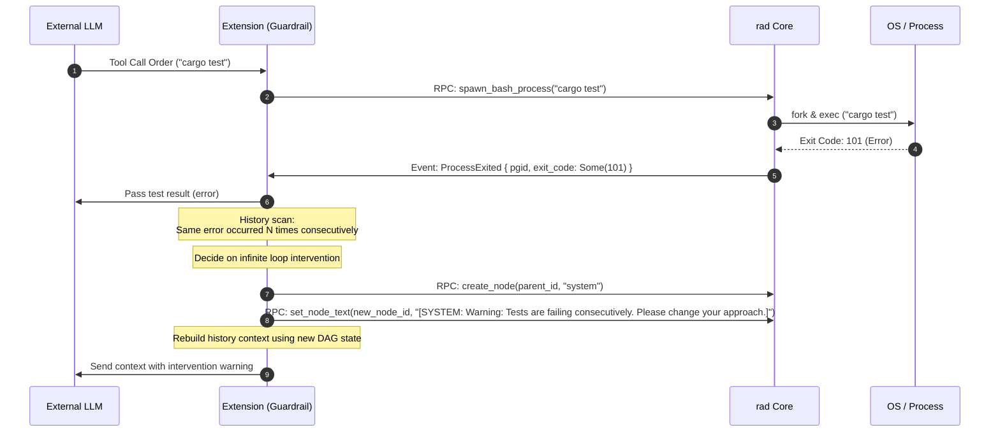
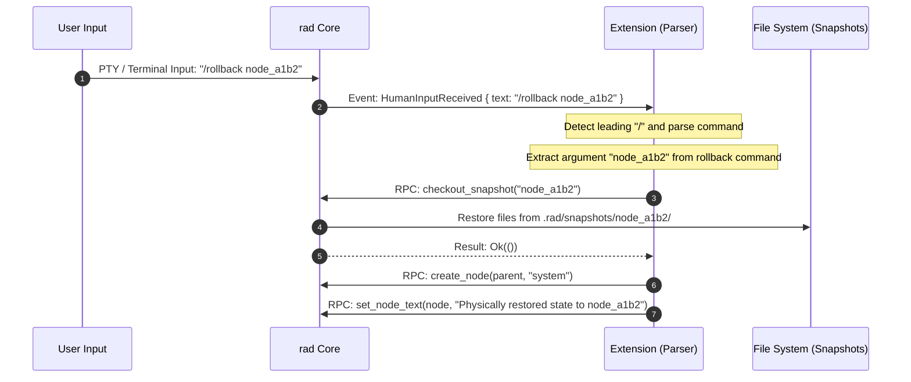
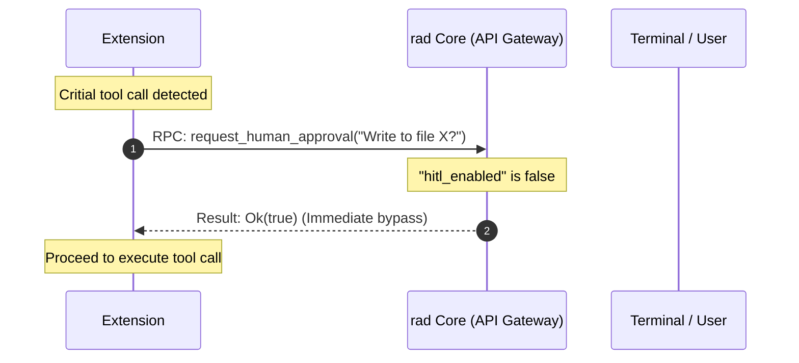
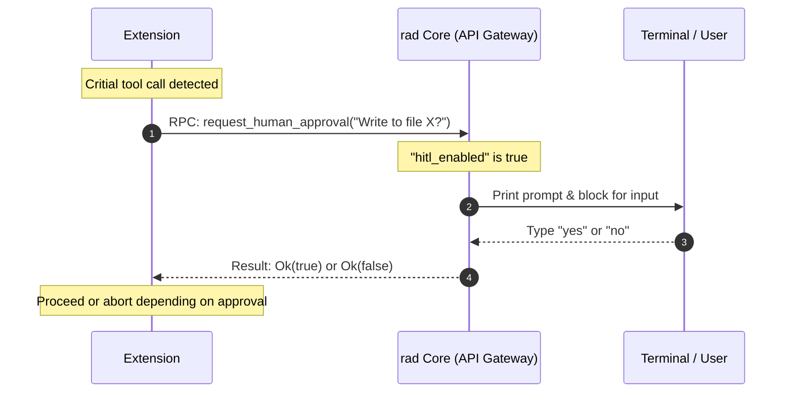

# `rad` (Rust Agent Dispatcher) Architecture Design Specification

This document defines the architecture design specification of the autonomous agent infrastructure `rad`, which consists of a low-level runtime "Core" (written in Rust) and "Extensions" running as WebAssembly (Wasm) modules.

The design principles prioritize **lightweightness, simplicity, and strict separation of control**.

---

## 1. System Topology & Separation of Control

`rad` adopts a two-layer structure that completely separates the **"Mechanism Layer"** (which handles OS-level privileged operations and physical execution) from the **"Policy Layer"** (which handles LLM context interpretation and agent decision-making).

```mermaid
graph TD
    User[Human Input / Terminal / Editor] -->|Input / Operations| Core[rad Core <br> Rust Runtime]
    
    subgraph CoreSystem [rad Core Crate]
        Core -->|1. TTY Input / Command| Gateway[API Gateway <br> (Capability Check)]
        Gateway -->|2. Dispatch| Subsystems[Subsystems <br> Trait-based: FS, Process, DAG, Network]
    end
    
    subgraph ExtensionSystem [Policy Layer]
        WasmRuntime[Wasm Runtime] -->|RPC Orders| Gateway
        Extension[Extensions <br> Stateless Wasm] -->|Prompt / Context / Compaction| LLM[External LLM API / Router]
        Subsystems -->|Event Stream: JSON Bytes| WasmRuntime
    end
```

### 1.1 Core (rad) Responsibility: Mechanism Layer
The Core focuses on executing low-level physical operations (primitives) on the OS, filesystem, and network streams, as well as detecting and dispatching physical events from each subsystem.
* **Statelessness**: The Core does not maintain or interpret any logical state related to semantics, such as prompts or conversation history. However, it manages the physical `DAG` representing history nodes to allow context preservation.
* **Trait-based Subsystem Isolation**: To keep the implementation clean and modular, all physical operations are encapsulated under internal Rust Traits (e.g., `FsSubsystem`, `ProcessSubsystem`).
* **API Gateway & Capability Check**: Wasm RPC requests pass through a single gateway that enforces the whitelists/blocklists configured in `rad.json` before delegating to the subsystems.

### 1.2 Extension Responsibility: Policy Layer
The Extension subscribes to the event stream from the Core and makes all logical control decisions.
* **WIT (Wasm Interface Type) & WASI (v0.7.0+)**: To enable multi-language extension development (Rust, Go, TypeScript, etc.), RPC contracts and events are defined in WIT IDL files. Low-level bindings are automatically compiled via `wit-bindgen`.
* **Statelessness (v0.2.2+)**: Instead of holding chat history in memory-based state arrays, the Extension fetches history dynamically from Core's DAG (`GetDag`) to ensure robustness across restarts.
* **Conversation/Thought Context Construction**: Manages the history (context) sent to the LLM.
* **Guardrails**: Applies safety checks before executing commands or editing files.
* **Compaction**: Summarizes or truncates history to stay within token limits.


---

## 2. State & Subsystem Specifications

The Core tracks and measures physical states through its subsystems and dispatches raw events when changes are detected.

### 2.1 Tracked States

1. **LLM Stream State (Network Subsystem)**
   * **Tracked Data**: The physical timestamp (millisecond precision) when the last byte (or token) was received, and the connection status (`Connecting`, `Streaming`, `Closed`, `Aborted`).
   * **Events**: Network packet arrivals, connection closures, and timeouts.
2. **Process State (Process Subsystem)**
   * **Tracked Data**: Process Group ID (PGID) list of child processes spawned by the Core, last activity time of standard I/O (`stdout`/`stderr`) for each PGID, and OS exit codes (`ExitStatus`).
   * **Events**: Process spawns, stdout/stderr data reception, and process exits.
3. **Filesystem State (FS Subsystem)**
   * **Tracked Data**: File addition, modification, and deletion events within the workspace (using crates like `notify`), and the index of snapshots under `.rad/snapshots/`.
   * **Events**: Physical changes on the filesystem.
4. **Graph State (DAG Subsystem)**
   * **Tracked Data**: Topology of the Directed Acyclic Graph (DAG) representing the session history (LLM thought paths, user instructions, tool results, etc.), and the current node identifier.
   * **Events**: Node creation, editing, deletion, and current node transitions.

### 2.2 Dynamic Timeout Control

To handle models that do not stream reasoning tokens or pause for a long time during internal reasoning, the stream monitoring timer values can be dynamically updated via RPC commands from the Extension.

* **`heartbeat_timeout_ms`**: The maximum allowed interval between packets during streaming. Triggers a timeout event if no tokens arrive within this duration.
* **`max_silent_wait_ms`**: The maximum quiet waiting time allowed for non-streaming models (e.g., models that output all text at once after completing reasoning).

---

## 3. Data Structures & IPC (Inter-Process Communication)

All communication crossing the Core-Extension boundary is serialized into JSON and sent/received via Wasm boundaries or thread channels.

### 3.1 Core to Extension Event Stream (`RasCoreEvent`)

Physical events detected by the Core are serialized using the following enum and sent to the Extension:

```rust
use serde::{Deserialize, Serialize};
use std::path::PathBuf;

#[derive(Debug, Clone, Serialize, Deserialize)]
#[serde(tag = "type", content = "payload")]
pub enum RasCoreEvent {
    // === LLM Communication ===
    /// Received a raw stream chunk from the HTTP connection
    HttpChunkReceived {
        chunk: String,
    },
    /// A tool execution request occurred from the LLM
    ToolCallRequested {
        call_id: String,
        name: String,
        args: serde_json::Value,
    },

    // === Process Monitoring (PTY / Bash) ===
    /// A new process group was spawned
    ProcessSpawned {
        pgid: i32,
        pid: i32,
    },
    /// Received data from the stdout of a process group
    ProcessStdout {
        pgid: i32,
        #[serde(with = "serde_bytes")]
        data: Vec<u8>,
    },
    /// Received data from the stderr of a process group
    ProcessStderr {
        pgid: i32,
        #[serde(with = "serde_bytes")]
        data: Vec<u8>,
    },
    /// The main process of a process group exited
    ProcessExited {
        pgid: i32,
        exit_code: Option<i32>,
    },

    // === Passive Sensors & Exception Detection ===
    /// A file in the workspace was modified
    FileChanged {
        path: PathBuf,
        change_type: String, // "create" | "modify" | "remove"
    },
    /// A timeout occurred for the specified target
    StreamTimeout {
        target: String, // "llm" | "process_<pgid>"
        duration_ms: u64,
    },
    /// Received an input line from the human user
    HumanInputReceived {
        text: String,
    },
}
```

### 3.2 Extension to Core Control RPC (`RasExtensionFacingApi`)

The interface definition for the Extension to command physical operations to the Core:

```rust
use std::collections::HashMap;
use std::path::{Path, PathBuf};

pub type StreamId = String;

#[derive(Debug, Clone, Serialize, Deserialize)]
pub enum Target {
    Llm,
    Process(i32),
}

#[derive(Debug, Clone, Serialize, Deserialize)]
pub enum TimeoutPolicy {
    Dynamic {
        heartbeat_timeout_ms: u64,
        max_silent_wait_ms: u64,
    },
    Infinite,
}

pub trait RasExtensionFacingApi {
    // === Execution of the 4 Physical Primitives ===
    /// Reads a file
    fn file_read(&self, path: &Path) -> Result<Vec<u8>, String>;
    
    /// Writes or overwrites a file
    fn file_write(&self, path: &Path, data: &[u8]) -> Result<(), String>;
    
    /// Edits a file partially by applying a unified diff/patch
    fn file_edit_patch(&self, path: &Path, diff: &str) -> Result<(), String>;
    
    /// Executes a bash command under a newly assigned isolated process group (PGID)
    fn spawn_bash_process(&self, command: &str) -> Result<i32, String>;

    // === DAG (History Graph) Operations ===
    /// Creates a new DAG node and returns its generated node ID
    fn create_node(&self, parent_id: &str, node_type: &str) -> String;
    
    /// Sets or updates the content (text) of a specified node
    fn set_node_text(&self, node_id: &str, text: &str) -> Result<(), String>;
    
    /// Merges multiple nodes into one and sets a summary text
    fn merge_nodes(&self, node_ids: Vec<String>, summary_text: &str) -> Result<(), String>;
    
    /// Deletes a DAG node
    fn delete_node(&self, node_id: &str) -> Result<(), String>;

    // === Snapshots (State Backup & Restoration) ===
    /// Saves the current workspace state (for target paths) and associates it with a node
    fn take_snapshot(&self, node_id: &str, target_paths: Vec<PathBuf>) -> Result<(), String>;
    
    /// Checks out the snapshot associated with the node, restoring physical files
    fn checkout_snapshot(&self, node_id: &str) -> Result<(), String>;

    // === Network & Timer Control ===
    /// Starts an HTTP(S) stream connection and streams response data via events
    fn open_http_stream(&self, url: &str, headers: HashMap<String, String>, body: &str) -> Result<StreamId, String>;
    
    /// Dynamically updates the timeout monitoring policy for a target (LLM connection or process)
    fn set_stream_timeout_policy(&self, target: Target, policy: TimeoutPolicy) -> Result<(), String>;

    /// Prints a string directly to the human terminal standard output
    fn write_stdout(&self, text: &str) -> Result<(), String>;
}
```

---

## 4. Robustness & Security Specifications

### 4.1 Process Group (PGID) Management for Child & MCP Processes

To prevent orphaned processes spawned by background shells or external MCP servers from running loose, the Core performs the following management:

1. **Isolated Process Group Creation**:
   Inside the child process (spawned via `spawn_bash_process` or `spawn_mcp_server`) after `fork`, the Core calls `setpgid(0, 0)` to allocate a new, independent PGID.
2. **Automatic Cleanup with Drop Trait**:
   The internal manager tracks active PGIDs. When the Core exits normally, receives `Ctrl+C`, or panics, the `Drop` implementation sends `kill(-pgid, SIGKILL)` to all registered PGIDs, including both spawned bash commands and external MCP servers.

### 4.2 Capability Access Control via a Single Config File (Capability Mask)

For a simple and robust security policy, configuration is restricted to a single `rad.json` file. Each Extension is constrained by specific permissions:

```json
{
  "hitl_enabled": false,
  "extensions": [
    {
      "name": "standard-orchestrator",
      "permissions": {
        "fs_read_allow": [
          "/path/to/rad"
        ],
        "fs_write_allow": [
          "/path/to/rad"
        ],
        "execution": {
          "allow_bash": true,
          "allow_commands": [
            "cargo check",
            "cargo clippy",
            "cargo test",
            "git"
          ],
          "block_commands": [
            "curl",
            "wget",
            "rm -rf /"
          ]
        },
        "network": {
          "allow_network": true,
          "allow_domains": [
            "api.openai.com",
            "api.anthropic.com",
            "github.com"
          ]
        },
        "allowed_mcp_servers": [
          "mcp-server-postgres",
          "mcp-server-git"
        ]
      }
    }
  ]
}
```

* **Local Verification**: The Core matches every RPC call (`file_read`, `file_write`, `spawn_bash_process`, `spawn_mcp_server`) against the Extension's `permissions` mask.
* **HITL Toggle**: The global `"hitl_enabled"` key dictates whether `request_human_approval` pauses execution for terminal authorization. If false (default), the Core operates in YOLO mode and instantly accepts the action.
* **Isolation Checks**:
  * For filesystem I/O, target paths are canonicalized (`canonicalize`) to detect and reject attempts to access files outside the whitelist via symlinks.
  * For command executions and MCP server requests, target executables are evaluated against whitelists.

---

## 5. Major Workflows and Dataflow Scenarios

### 5.1 Exception Handling (Infinite Loop Detection and Intervention)

If the LLM falls into a logical freeze state (repeating the same command and error), the Extension's guardrail layer detects it and intervenes via DAG manipulation.



### 5.2 Diversity Protocol (Handling Different API Schemas)

The Core is completely unaware of LLM-specific API differences (OpenAI, Anthropic, Ollama, etc.) or MCP (Model Context Protocol) schemas.

```mermaid
sequenceDiagram
    autonumber
    participant LLM as Anthropic API
    participant Adapter as Ext: Protocol Adapter
    participant Loop as Ext: Main Loop
    participant Core as rad Core

    Loop->>Adapter: Send request (prompt/history)
    Note over Adapter: Create Anthropic JSON <br> {"model": "claude-...", "messages": [...]}
    Adapter->>Core: RPC: open_http_stream("https://api.anthropic.com/...", headers, body)
    Core->>LLM: HTTP Request (Stream)
    Core->>Adapter: Event: HttpChunkReceived { chunk: "..." } <br> (Core forwards raw chunk)
    Note over Adapter: Parse raw chunk to extract content
    Adapter->>Core: RPC: WriteStdout { text: "..." }
    Core->>Terminal: Print token to screen
    Adapter->>Loop: Convert to unified format and dispatch event
```

### 5.3 Slash Commands (Meta Commands)

For slash commands (commands starting with `/`) entered by users, the Core simply passes the text event, and the Extension handles parsing and execution control.



### 5.4 Unified Tooling, Policy Offloading, and Rollback Boundaries

`rad` follows a strict philosophy of keeping the Core simple and offloading all logical policy decisions, workflow state-machines, and safety wrappers to Wasm Extensions. In this architecture, all tools (basic OS primitives, custom Skills, Workflows, and external MCP servers) are presented to the LLM as unified, flat Tool Calls.

### 5.4.1 Tool Abstraction & Discovery

1. **Basic OS Primitives (Core)**:
   * Low-level primitives like `file_read`, `file_write`, `file_edit_patch`, and `spawn_bash_process` are exposed by the Core through the API Gateway.
2. **Skills (Local Scripts)**:
   * Executable scripts are placed in `.rad/skills/`. The Extension collects these scripts' specifications at startup and registers them to the LLM's tool pool. The LLM executes them by calling the script paths via `spawn_bash_process`.
3. **External Model Context Protocol (MCP)**:
   * Connection and schema mapping for external MCP servers are handled on the Extension side. The Extension fetches tool schemas from MCP servers, merges them with local schemas, and forwards tool invocations to the respective MCP servers.
4. **Workflows (State Management)**:
   * Workflow structures (such as the Plan-Execute-Test-Commit cycle) are managed entirely by the Extension. The Extension tracks the state (either via a config file like `state.json` or explicitly in DAG nodes) and may dynamically inject phase instructions into the system prompt or restrict the set of tools available to the LLM for that specific phase.

### 5.4.2 Rollback Boundaries & External Side-Effects

Because `rad` provides filesystem snapshot backups under `.rad/snapshots/`, there is a clear physical boundary between rollback-capable operations and non-rollback-capable operations:

* **Rollback-Capable (Local State)**:
  * Operations involving local file editing (`file_write`, `file_edit_patch`) are tracked by the Core's snapshot mechanism. If the agent fails a task, the local files can be rolled back to a clean state.
* **Non-Rollback-Capable (External Side-Effects)**:
  * Tools originating from external MCP servers or certain Skills (e.g., Slack notifications, GitHub PR creations, cloud database updates) produce external side-effects. These cannot be reversed by `rad`'s local snapshots.
* **Architecture Guideline**:
  * Because the LLM sees all tools as a flat list, the Extension (or the system prompt/rules) must enforce safety boundaries. For non-rollback-capable (non-reversible) tools, the Extension is encouraged to intercept the invocation and block for explicit human confirmation (Human-in-the-Loop) before routing the request.

### 5.5 Human-in-the-Loop (HITL) & YOLO Mode Workflows

When the Extension intercepts a critical action (e.g., executing shell scripts or writing files) and decides to request human authorization, it invokes the Core RPC `request_human_approval`. The response is dictated by the `"hitl_enabled"` configuration in `rad.json`.

#### 5.5.1 YOLO Mode (Default: `hitl_enabled: false`)
When HITL is disabled, the Core operates in YOLO mode and instantly returns approval to the Wasm extension without prompt interruption.



#### 5.5.2 Interactive HITL Mode (`hitl_enabled: true`)
When HITL is enabled, the Core suspends Wasm execution, outputs the prompt to the terminal, and waits for interactive user response.



