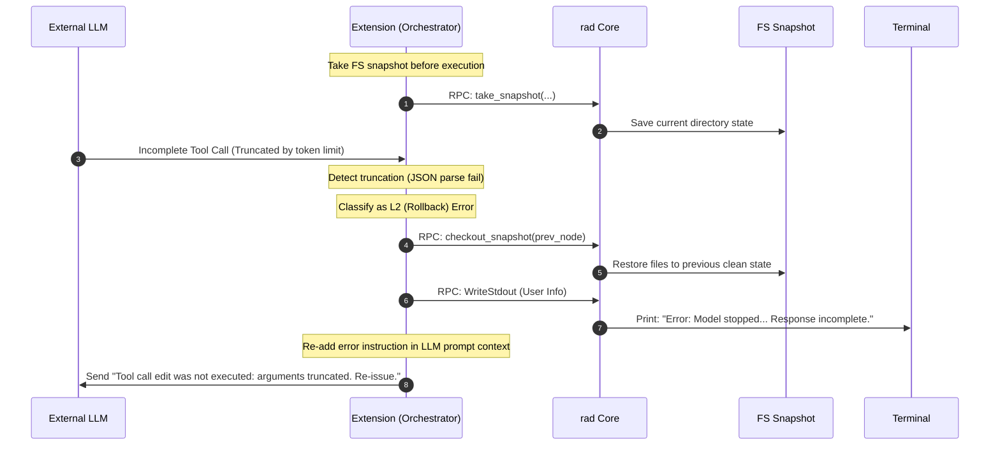
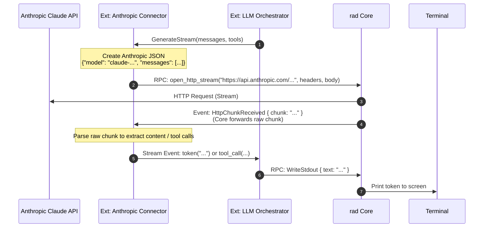
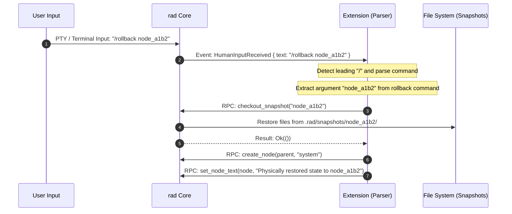
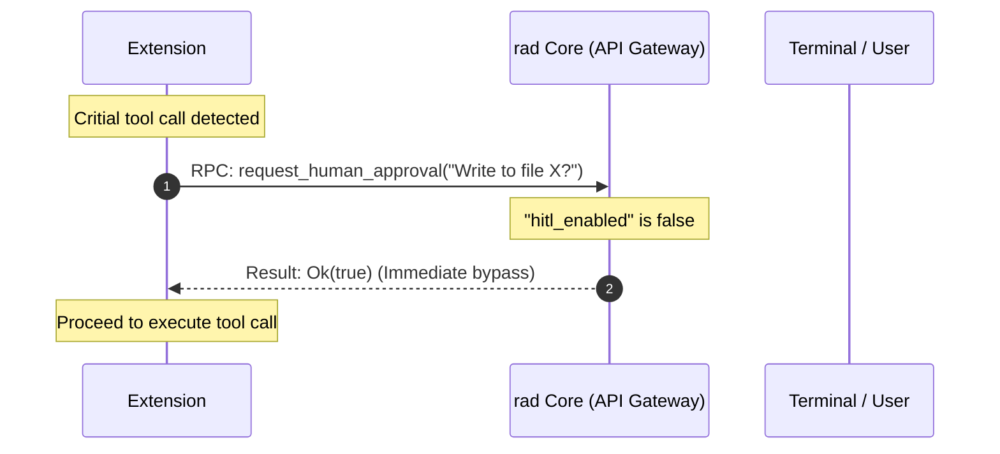
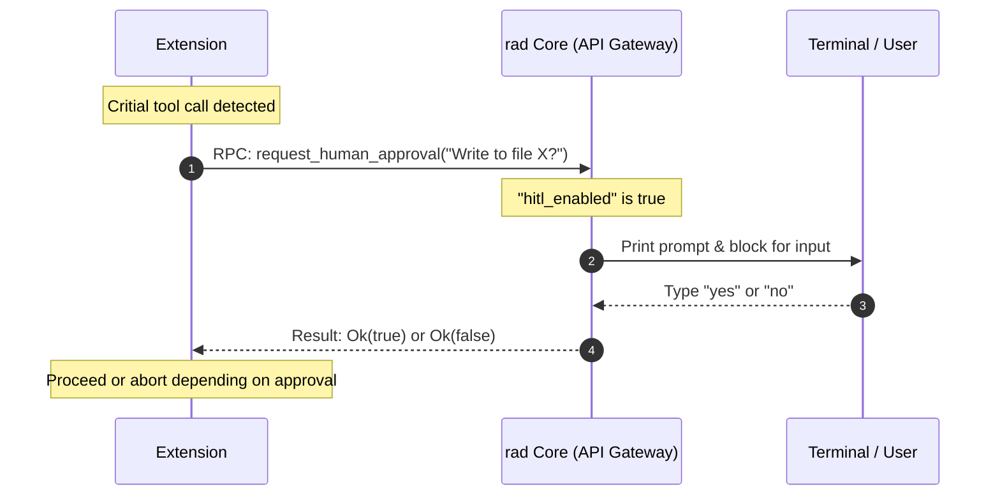

# `rad` (Rust Agent Dispatcher) Architecture Design Specification

This document defines the architecture design specification of the autonomous agent infrastructure `rad`, which consists of a low-level runtime "Core" (written in Rust) and "Extensions" running as WebAssembly (Wasm) modules.

The design principles prioritize **lightweightness, simplicity, and strict separation of control**.

---

## 1. System Topology & Separation of Control

`rad` adopts a two-layer structure that completely separates the **"Mechanism Layer"** (which handles OS-level privileged operations and physical execution) from the **"Policy Layer"** (which handles LLM context interpretation and agent decision-making).

```mermaid
graph TD
    User[Human Input / Terminal / Editor] -->|Input / Operations| Core[rad Core <br> Rust Runtime]
    
    subgraph CoreSystem [rad Core Crate]
        Core -->|1. TTY Input / Command| Gateway[API Gateway <br> (Capability Check)]
        Gateway -->|2. Dispatch| Subsystems[Subsystems <br> Trait-based: FS, Process, DAG, Network]
    end
    
    subgraph ExtensionSystem [Policy Layer / Multi-Extension Cooperation]
        WasmRuntime[Wasm Runtime] -->|RPC Orders / Verification| Gateway
        
        Orchestrator["1. LLM Orchestrator <br> (orchestrator.wasm)"]
        Connector["2. LLM Connector <br> (openai-connector.wasm)"]
        SecurityGuard["3. Security Guard <br> (security-rules.wasm)"]
        ToolProvider["4. Tool/MCP Provider <br> (mcp-bridge.wasm)"]

        Orchestrator -->|1. Generate Stream| Connector
        Connector -->|2. Request Stream RPC| WasmRuntime
        WasmRuntime -->|3. Route Connection| Gateway
        Orchestrator -->|4. Exec Tool RPC| WasmRuntime
        WasmRuntime -->|5. Query Hook| SecurityGuard
        WasmRuntime -->|6. Resolve Tools| ToolProvider
    end
```

### 1.1 Core (rad) Responsibility: Mechanism Layer
The Core focuses on executing low-level physical operations (primitives) on the OS, filesystem, and network streams, as well as detecting and dispatching physical events from each subsystem.
* **Statelessness**: The Core does not maintain or interpret any logical state related to semantics, such as prompts or conversation history. However, it manages the physical `DAG` representing history nodes to allow context preservation.
* **Trait-based Subsystem Isolation**: To keep the implementation clean and modular, all physical operations are encapsulated under internal Rust Traits (e.g., `FsSubsystem`, `ProcessSubsystem`).
* **API Gateway & Capability Check**: Wasm resource handle instantiation requests (like `open-file`, `open-process`, `execute-tool`) pass through a single gateway that enforces the whitelists/blocklists configured in `rad.json` before returning resource handles to Wasm guests.

### 1.2 Extension Responsibility: Policy Layer
The Extension subscribes to the event stream from the Core and makes all logical control decisions.
* **WIT (Wasm Interface Type) & WASI (v0.7.0+)**: To enable multi-language extension development (Rust, Go, TypeScript, etc.), RPC contracts and events are defined in WIT IDL files. Low-level bindings are automatically compiled via `wit-bindgen`.
* **Unified Capability-Centric Architecture (UCCA)**: The Wasm guest interacts with the host through strongly-typed resource handles (`stream-handle`, `file-handle`, `execution-handle`) instead of generic JSON messages. For example, reading logs or process stdout is done by pulling bytes through a `stream-handle`, preventing unwanted side-effects.
* **Statelessness (v0.2.2+)**: Instead of holding chat history in memory-based state arrays, the Extension fetches history dynamically from Core's DAG (`GetDag`) to ensure robustness across restarts.
* **Conversation/Thought Context Construction**: Manages the history (context) sent to the LLM.
* **Compaction**: Summarizes or truncates history to stay within token limits.

### 1.3 Multi-Extension Cooperation & Responsibility Isolation
To maximize modularity and robustness, `rad` supports chaining multiple extensions simultaneously. Instead of a single monolithic extension, policies are isolated into micro-extensions:

1. **LLM Orchestrator (Decision Loop)**
   - **Responsibility**: Manages the prompt logic, calls the LLM, and orchestrates the steps of the agent loop.
   - **Isolation**: Focuses strictly on token completion and reasoning, calling tools abstractly via Core APIs.
2. **Security Guard (Validation / verify-rpc)**
   - **Responsibility**: Implements deep inspect rules to approve or deny resource instantiation requests (such as opening path `blocked.txt`) before the host returns the handle.
   - **Isolation**: Even if the Orchestrator is hijacked via prompt injection, the independent Security Guard Wasm prevents damage (sandboxed verification).
3. **Tool/MCP Provider (Capability Bridging)**
   - **Responsibility**: Discovers, parses, and resolves dynamic schemas for external tools (e.g., via MCP servers) and marshals tool calls/replies.
4. **LLM Connector (Model API translation & streaming)**
   - **Responsibility**: Translates standardized Message objects and tool definitions into model-specific API payloads, initiates connections (using Core HTTP capability), and parses SSE stream chunks.
   - **Isolation**: Decouples model-specific network packet parsing and JSON payload generation from the Orchestrator, rendering the main decision loop fully model-agnostic.

---


## 2. State & Subsystem Specifications

The Core tracks and measures physical states through its subsystems and dispatches raw events when changes are detected.

### 2.1 Tracked States

1. **LLM Stream State (Network Subsystem)**
   * **Tracked Data**: The physical timestamp (millisecond precision) when the last byte (or token) was received, and the connection status (`Connecting`, `Streaming`, `Closed`, `Aborted`).
   * **Events**: Network packet arrivals, connection closures, and timeouts.
2. **Process State (Process Subsystem)**
   * **Tracked Data**: Process Group ID (PGID) list of child processes spawned by the Core, last activity time of standard I/O (`stdout`/`stderr`) for each PGID, and OS exit codes (`ExitStatus`).
   * **Events**: Process spawns, stdout/stderr data reception, and process exits.
3. **Filesystem State (FS Subsystem)**
   * **Tracked Data**: File addition, modification, and deletion events within the workspace (using crates like `notify`), and the index of snapshots under `.rad/snapshots/`.
   * **Events**: Physical changes on the filesystem.
4. **Graph State (DAG Subsystem)**
   * **Tracked Data**: Topology of the Directed Acyclic Graph (DAG) representing the session history (LLM thought paths, user instructions, tool results, etc.), and the current node identifier.
   * **Events**: Node creation, editing, deletion, and current node transitions.

### 2.2 Dynamic Timeout Control

To handle models that do not stream reasoning tokens or pause for a long time during internal reasoning, the stream monitoring timer values can be dynamically updated via RPC commands from the Extension.

* **`heartbeat_timeout_ms`**: The maximum allowed interval between packets during streaming. Triggers a timeout event if no tokens arrive within this duration.
* **`max_silent_wait_ms`**: The maximum quiet waiting time allowed for non-streaming models (e.g., models that output all text at once after completing reasoning).

---

## 3. Data Structures & IPC (Inter-Process Communication)

All communication crossing the Core-Extension boundary is serialized into JSON and sent/received via Wasm boundaries or thread channels.

### 3.1 Core to Extension Event Stream (`RasCoreEvent`)

Physical events detected by the Core are serialized using the following enum and sent to the Extension:

```rust
use serde::{Deserialize, Serialize};
use std::path::PathBuf;

#[derive(Debug, Clone, Serialize, Deserialize)]
#[serde(tag = "type", content = "payload")]
pub enum RasCoreEvent {
    // === LLM Communication ===
    /// Received a raw stream chunk from the HTTP connection
    HttpChunkReceived {
        chunk: String,
    },
    /// Received an error from the HTTP connection
    HttpErrorReceived {
        error: String,
    },
    /// A tool execution request occurred from the LLM
    ToolCallRequested {
        call_id: String,
        name: String,
        args: serde_json::Value,
    },
    /// Indicates a task was successfully completed
    TaskCompleted,
    /// Provides history of pending tool calls to rehydrate extension state
    Rehydrate {
        pending_tool_calls: Vec<PendingToolCallInfo>,
    },
    /// A response from an external MCP server
    McpResponse {
        name: String,
        message: String,
    },

    // === Process Monitoring (PTY / Bash) ===
    /// A new process group was spawned
    ProcessSpawned {
        pgid: i32,
        pid: i32,
    },
    /// Received data from the stdout of a process group
    ProcessStdout {
        pgid: i32,
        #[serde(with = "serde_bytes")]
        data: Vec<u8>,
    },
    /// Received data from the stderr of a process group
    ProcessStderr {
        pgid: i32,
        #[serde(with = "serde_bytes")]
        data: Vec<u8>,
    },
    /// The main process of a process group exited
    ProcessExited {
        pgid: i32,
        exit_code: Option<i32>,
    },

    // === Passive Sensors & Exception Detection ===
    /// A file in the workspace was modified
    FileChanged {
        path: PathBuf,
        change_type: String, // "create" | "modify" | "remove"
    },
    /// A timeout occurred for the specified target
    StreamTimeout {
        target: String, // "llm" | "process_<pgid>"
        duration_ms: u64,
    },
    /// Received an input line from the human user
    HumanInputReceived {
        text: String,
    },
}
```

### 3.2 Extension to Core Resource & RPC Interface (`rad.wit`)

The extension communicates with the host core using strongly-typed resource handles and host-rpc functions defined in `wit/rad.wit`.

#### 3.2.1 Core Resources

1. **`stream-handle`** (Pull-based I/O stream):
   ```wit
   resource stream-handle {
       read: func(max-bytes: u32) -> result<list<u8>, string>;
       write: func(data: list<u8>) -> result<_, string>;
       close: func();
   }
   ```
2. **`file-handle`** (Random-access file operations):
   ```wit
   resource file-handle {
       read-at: func(offset: u64, len: u32) -> result<list<u8>, string>;
       write-at: func(offset: u64, data: list<u8>) -> result<_, string>;
       get-stream: func() -> stream-handle;
   }
   ```
3. **`execution-handle`** (Supervised subprocess execution):
   ```wit
   resource execution-handle {
       get-stdout: func() -> stream-handle;
       get-stderr: func() -> stream-handle;
       get-stdin: func() -> stream-handle;
       wait: func() -> result<s32, string>;
       kill: func();
   }
   ```

#### 3.2.2 Host Resource Openers

* **`open-file(path: string, writeable: bool) -> result<file-handle, string>`**:
  Resolves and canonicalizes `path` against the workspace root sandbox. If authorized, returns an opaque file handle resource.
* **`open-process(command: string) -> result<execution-handle, string>`**:
  Spawns a bash process in a new PGID, returning a supervised execution handle resource.
* **`execute-tool(name: string, arguments: string) -> result<execution-handle, string>`**:
  Delegates the tool execution to the appropriate tool provider extension or MCP server, returning a streamable execution handle resource.
* **`open-http-stream(url: string, headers: list<tuple<string, string>>, body: string) -> result<stream-handle, string>`**:
  Starts an asynchronous network stream and returns a `stream-handle` to read LLM stream tokens.

#### 3.2.3 Generic Host RPC commands (`host-rpc`)

Functions that do not require continuous byte streaming or handles are mapped through a single `host-rpc` command router:

```wit
variant ras-rpc-command {
    file-read(string),
    file-write(file-write-payload),
    file-edit-patch(file-patch-payload),
    spawn-bash-process(string),
    create-node(create-node-payload),
    set-node-text(set-node-text-payload),
    merge-nodes(merge-nodes-payload),
    delete-node(string),
    take-snapshot(take-snapshot-payload),
    checkout-snapshot(string),
    open-http-stream(open-http-stream-payload),
    set-stream-timeout-policy(set-stream-timeout-policy-payload),
    write-stdout(string),
    complete-task,
    get-dag,
    ask-human-approval(string),
    report-token-usage(report-token-usage-payload),
    spawn-mcp-server(spawn-mcp-server-payload),
    send-mcp-request(send-mcp-request-payload),
    get-repo-map,
    get-tools,
    execute-tool(execute-tool-payload),
}
```


---

## 4. Robustness & Security Specifications

### 4.1 Process Group (PGID) Management for Child & MCP Processes

To prevent orphaned processes spawned by background shells or external MCP servers from running loose, the Core performs the following management:

1. **Isolated Process Group Creation**:
   Inside the child process (spawned via `spawn_bash_process` or `spawn_mcp_server`) after `fork`, the Core calls `setpgid(0, 0)` to allocate a new, independent PGID.
2. **Automatic Cleanup with Drop Trait**:
   The internal manager tracks active PGIDs. When the Core exits normally, receives `Ctrl+C`, or panics, the `Drop` implementation sends `kill(-pgid, SIGKILL)` to all registered PGIDs, including both spawned bash commands and external MCP servers.

### 4.2 Capability Access Control via a Single Config File (Capability Mask)

For a simple and robust security policy, configuration is restricted to a single `rad.json` file. Each Extension is constrained by specific permissions:

```json
{
  "core": {
    "workspace_dir": ".",
    "snapshot_dir": ".rad/snapshots",
    "log_dir": ".rad/logs"
  },
  "extensions": [
    {
      "name": "openai-orchestrator",
      "source": "target/wasm32-wasip2/release/openai_orchestrator.wasm",
      "enabled": true,
      "permissions": {
        "fs_read_allow": ["*"],
        "fs_write_allow": ["*"]
      }
    },
    {
      "name": "rust-template-extension",
      "source": "templates/rust/target/wasm32-wasip1/release/rad_extension_template.wasm",
      "enabled": true,
      "permissions": {
        "fs_read_allow": ["*"],
        "fs_write_allow": ["*"],
        "rpc_allow": ["WriteStdout"]
      }
    }
  ]
}
```

* **Local Verification**: The Core matches every RPC call (`file_read`, `file_write`, `spawn_bash_process`, `spawn_mcp_server`) against the Extension's `permissions` mask.
* **Core Configuration**: The `core` block defines the workspace, snapshot, and log directories used by the runtime.
* **Extension Configuration**: Each entry in `extensions` defines the Wasm module source, its enabled status, and its specific capability mask.

---

## 5. Major Workflows and Dataflow Scenarios

### 5.1 Unified Error Handling & Exception Management (3-Pillar Strategy)

`rad` adopts a structured, transactional error-handling architecture across the Core-Extension boundary. Errors are treated as state transitions within the DAG to ensure system consistency and enable autonomous recovery.

#### 5.1.1 The Three Pillars (三つの柱)

1. **Pillar 1: Error Normalization (`UnifiedError`)**
   Every physical error detected by the host core (IO errors, execution failures, HTTP connection timeouts, or token limits) is standardized into a serialized `UnifiedError` JSON payload inside the WIT boundary's `result<T, string>`. This avoids breaking interface compatibility while permitting rich, structured classification on the guest extension side.
   * **L1 (Adaptation)**: Transient API drops or tool/command errors. **Strategy**: Append error node to DAG, feed back to LLM, and retry.
   * **L2 (Rollback)**: LLM parsing failures (e.g. truncated JSON from output token limit) or capability violations. **Strategy**: Roll back current DAG pointer and physically restore the filesystem state.
   * **L3 (Reset)**: Context window exhaustion (token budget exceeded). **Strategy**: Compress context via `context-tools` DAG pruning/summarization and reset state.

2. **Pillar 2: Deterministic State Transition & File Rollback Synchronization**
   * **File Snapshots**: The Core automatically takes directories snapshot backups (`src/fs/snapshot.rs`) before entering LLM thinking phases and executing tools.
   * **Sync Recovery**: On L2 rollback, the system not only rolls back the active DAG node pointer but also checks out/restores the corresponding filesystem snapshot synchronously to prevent local workspace pollution.

3. **Pillar 3: Dual-Track Feedback**
   * **Raw Track (LLM-facing)**: Stack traces, truncated JSON snippets, compilation errors, and complete command stderr are written to the DAG context for self-correction.
   * **Semantic Track (User-facing)**: Clean, non-technical status messages (e.g., `"Error: Model stopped because it reached the maximum output token limit. The response may be incomplete."`) are output to stdout/UI to maintain user trust and predictability.



### 5.2 Diversity Protocol (Handling Different API Connectors)

The Core is completely unaware of LLM-specific API differences (OpenAI, Anthropic, Ollama, etc.) or MCP (Model Context Protocol) schemas. Model adaptation is offloaded to a specialized, hot-swappable **LLM Connector** Wasm extension.



### 5.3 Slash Commands (Meta Commands)

For slash commands (commands starting with `/`) entered by users, the Core simply passes the text event, and the Extension handles parsing and execution control.



### 5.4 Unified Tooling, Policy Offloading, and Rollback Boundaries

`rad` follows a strict philosophy of keeping the Core simple and offloading all logical policy decisions, workflow state-machines, and safety wrappers to Wasm Extensions. In this architecture, all tools (basic OS primitives, custom Skills, Workflows, and external MCP servers) are presented to the LLM as unified, flat Tool Calls.

### 5.4.1 Tool Abstraction & Discovery

1. **Basic OS Primitives (Core)**:
   * Low-level primitives like `file_read`, `file_write`, `file_edit_patch`, and `spawn_bash_process` are exposed by the Core through the API Gateway, and are presented to the LLM as shorter, clean tool names: `read`, `write`, `edit`, and `bash`.
2. **Skills (Local Scripts)**:
   * Executable scripts are placed in `.rad/skills/`. The Extension collects these scripts' specifications at startup and registers them to the LLM's tool pool. The LLM executes them by calling the script paths via the `bash` tool.
3. **External Model Context Protocol (MCP)**:
   * Connection and schema mapping for external MCP servers are handled on the Extension side. The Extension fetches tool schemas from MCP servers, merges them with local schemas, and forwards tool invocations to the respective MCP servers.
4. **Workflows (State Management)**:
   * Workflow structures (such as the Plan-Execute-Test-Commit cycle) are managed entirely by the Extension. The Extension tracks the state (either via a config file like `state.json` or explicitly in DAG nodes) and may dynamically inject phase instructions into the system prompt or restrict the set of tools available to the LLM for that specific phase.

### 5.4.2 Rollback Boundaries & External Side-Effects

Because `rad` provides filesystem snapshot backups under `.rad/snapshots/`, there is a clear physical boundary between rollback-capable operations and non-rollback-capable operations:

* **Rollback-Capable (Local State)**:
  * Operations involving local file editing (`file_write`, `file_edit_patch`) are tracked by the Core's snapshot mechanism. If the agent fails a task, the local files can be rolled back to a clean state.
* **Non-Rollback-Capable (External Side-Effects)**:
  * Tools originating from external MCP servers or certain Skills (e.g., Slack notifications, GitHub PR creations, cloud database updates) produce external side-effects. These cannot be reversed by `rad`'s local snapshots.
* **Architecture Guideline**:
  * Because the LLM sees all tools as a flat list, the Extension (or the system prompt/rules) must enforce safety boundaries. For non-rollback-capable (non-reversible) tools, the Extension is encouraged to intercept the invocation and block for explicit human confirmation (Human-in-the-Loop) before routing the request.

### 5.5 Human-in-the-Loop (HITL) & YOLO Mode Workflows

When the Extension intercepts a critical action (e.g., executing shell scripts or writing files) and decides to request human authorization, it invokes the Core RPC `request_human_approval`. The response is dictated by the `"hitl_enabled"` configuration in `rad.json`.

#### 5.5.1 YOLO Mode (Default: `hitl_enabled: false`)
When HITL is disabled, the Core operates in YOLO mode and instantly returns approval to the Wasm extension without prompt interruption.



#### 5.5.2 Interactive HITL Mode (`hitl_enabled: true`)
When HITL is enabled, the Core suspends Wasm execution, outputs the prompt to the terminal, and waits for interactive user response.



