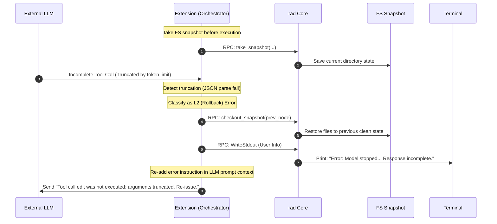
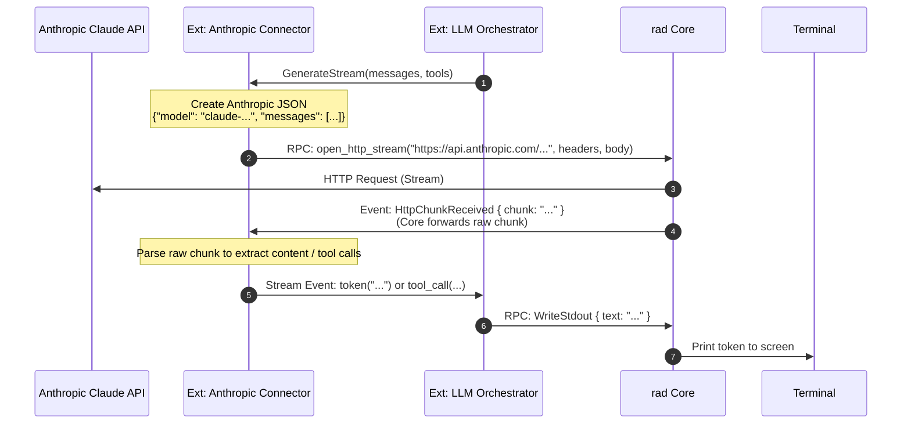
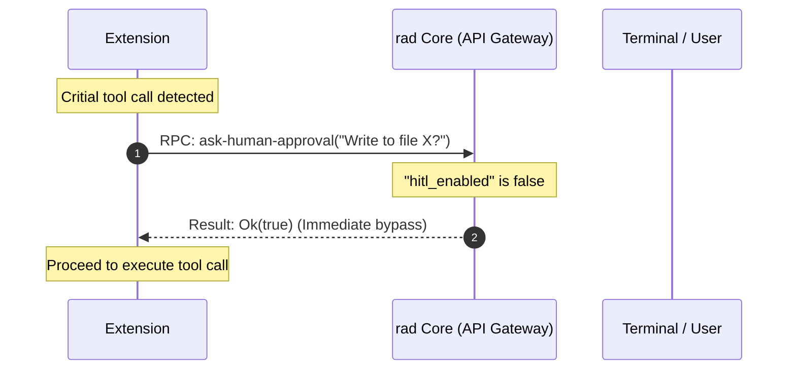
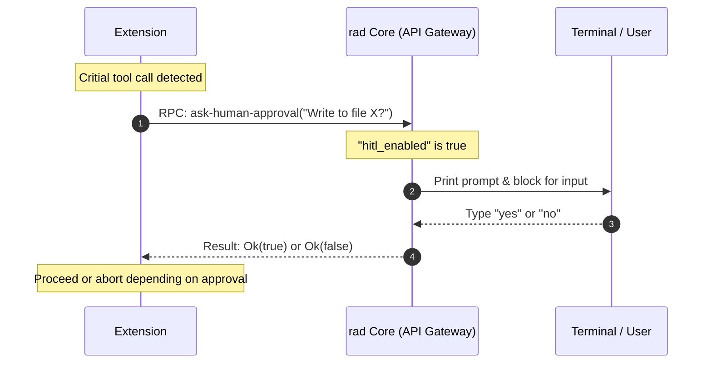

# `rad` (Rust Agent Dispatcher) Architecture Design Specification

This document defines the architecture design specification of the autonomous agent infrastructure `rad`, which consists of a low-level runtime "Core" (written in Rust) and "Extensions" running as WebAssembly (Wasm) modules.

The design principles prioritize **lightweightness, simplicity, and strict separation of control**.

---

## 1. System Topology & Separation of Control

`rad` adopts a two-layer structure that completely separates the **"Mechanism Layer"** (which handles OS-level privileged operations and physical execution) from the **"Policy Layer"** (which handles LLM context interpretation and agent decision-making).

```mermaid
graph TD
    User[Human Input / Terminal / Editor] -->|Input / Operations| Core[rad Core <br> Rust Runtime]
    
    subgraph CoreSystem [rad Core Crate]
        Core -->|1. TTY Input / Command| Gateway[API Gateway <br> (Capability Check)]
        Gateway -->|2. Dispatch| Subsystems[Subsystems <br> Trait-based: FS, Process, DAG, Network]
    end
    
    subgraph ExtensionSystem [Policy Layer / Multi-Extension Cooperation]
        WasmRuntime[Wasm Runtime] -->|RPC Orders / Verification| Gateway
        
        Orchestrator["1. LLM Orchestrator <br> (rad_orchestrator.wasm)"]
        Connector["2. LLM Transport <br> (llm_openai_module.wasm — kernel module)"]
        SecurityGuard["3. Security Guard <br> (security_guard.wasm)"]
        ToolProvider["4. Tool/MCP Provider <br> (mcp_module.wasm — kernel module)"]
        SkillModule["5. Skills <br> (skills_module.wasm — kernel module)"]
        ContextModule["6. Context Compactor <br> (context_module.wasm — kernel module)"]

        Orchestrator -->|1. Generate Stream| Connector
        Connector -->|2. Request Stream RPC| WasmRuntime
        WasmRuntime -->|3. Route Connection| Gateway
        Orchestrator -->|4. Exec Tool RPC| WasmRuntime
        WasmRuntime -->|5. Query Hook| SecurityGuard
        WasmRuntime -->|6. Resolve Tools| ToolProvider
        WasmRuntime -->|7. Discover Skills| SkillProvider
        Orchestrator -->|8. Compact History| ContextCompactor
    end
```

### 1.1 Core (rad) Responsibility: Mechanism Layer
The Core focuses on executing low-level physical operations (primitives) on the OS, filesystem, and network streams, as well as detecting and dispatching physical events from each subsystem.
* **Statelessness**: The Core does not maintain or interpret any logical state related to semantics, such as prompts or conversation history. However, it manages the physical `DAG` representing history nodes to allow context preservation.
* **Trait-based Subsystem Isolation**: To keep the implementation clean and modular, all physical operations are encapsulated under internal Rust Traits (e.g., `FsSubsystem`, `ProcessSubsystem`).
* **API Gateway & Capability Check**: Wasm resource-instantiation and RPC requests pass through a single gateway before any handle is returned. Two distinct checks apply, and they do **not** cover the same set of calls:
  * **Capability mask** (`permissions::check_permissions`, driven by `rad.json`): applied to calls that name a physical resource — `open-file`/`file-read`/`file-write`/`list-dir`, `open-process`/`spawn-bash-process`, `open-http-stream`. This is what applies `fs_read_allow`/`fs_write_allow`/`execution`/`network` **to calls that come through this gateway** — see the enforcement note below.
  * **Security-guard hook** (`verify_rpc_exclude`): applied additionally, delegating an approve/deny decision to the `security` role extension.
  * `execute-tool` is deliberately **only** subject to the security-guard hook, not the capability mask: `PermissionConfig` has no dimension describing "which tools may be invoked", so a mask check there would be structurally vacuous. Introducing a real per-extension tool allowlist would be a new permission dimension, not a fix to this layer.

> [!IMPORTANT]
> **What the capability mask actually enforces.** The mask governs calls that pass through the host RPC surface. It is not a containment boundary, for two independent reasons — both verified against the running system, not inferred:
>
> 1. **Extensions can bypass it with `std::fs`.** `src/wasm/loader.rs` gives every extension WASI preopens for `.` and `$HOME` with `DirPerms::all()` / `FilePerms::all()`. An extension that calls `std::fs` directly reads and writes the entire home directory without touching the gateway, the mask, or the security guard. This was demonstrated by adding three lines to an extension and observing the write succeed. Every extension `rad` ships routes through the RPC surface by convention, and the mask constrains those calls — but nothing forces that choice.
> 2. **Tools do not run inside the sandbox at all.** Tools come from MCP servers, which are separate OS processes holding the user's full privileges. `core-utilities-mcp` calls `std::fs::write` in its own process; `rad` never observes those writes, so no mask can apply to them.
>
> What *is* genuinely enforced is the WebAssembly sandbox itself — an extension cannot reach outside its preopens, corrupt host memory, or call a host function the world does not export — together with process-group cleanup (§2.1). Treat `fs_read_allow`/`fs_write_allow` as a guard rail for cooperating extensions and a statement of intent, not as a security boundary against hostile code.
>
> Narrowing the preopens would make the mask real; no shipped extension currently calls `std::fs`, so the change is plausible but untested.

### 1.2 Extension Responsibility: Policy Layer
The Extension subscribes to the event stream from the Core and makes all logical control decisions.
* **WIT (Wasm Interface Type) & WASI (v0.7.0+)**: To enable multi-language extension development (Rust, Go, TypeScript, etc.), RPC contracts and events are defined in WIT IDL files. Low-level bindings are automatically compiled via `wit-bindgen`.
* **Unified Capability-Centric Architecture (UCCA)**: The Wasm guest interacts with the host through strongly-typed resource handles (`stream-handle`, `file-handle`, `execution-handle`) instead of generic JSON messages. For example, reading logs or process stdout is done by pulling bytes through a `stream-handle`, preventing unwanted side-effects.
* **Statelessness (v0.2.2+)**: Instead of holding chat history in memory-based state arrays, the Extension fetches history dynamically from Core's DAG (`GetDag`) to ensure robustness across restarts.
* **Conversation/Thought Context Construction**: The LLM Orchestrator walks the DAG from `current_node_id`, deserializes each node into a `Message`, filters orphaned tool-call nodes, and assembles the system prompt. This step is mechanical (no judgment about what to keep or discard) and stays tightly coupled to the DAG data model, so it remains in the Orchestrator rather than being delegated.
* **Compaction**: All policy decisions about what to keep, discard, or summarize once history grows too large are delegated to the `context-tools` extension via RPC. `context-tools` receives the assembled message list plus count/size budgets and returns a trimmed result. Its `optimize` entry point applies, in order: size-aware stale tool-result clearing, then history windowing constrained by *both* a message-count budget and a character budget derived from the active endpoint's real context window (whichever is more restrictive), with lexical relevance-based retention allowed to reinstate an earlier turn that the raw window would have dropped. An earlier role-based squashing pass that collapsed consecutive `tool` messages was removed because it could silently drop a tool result still referenced by a preceding `assistant` message's `tool_calls` array, producing API-invalid requests. Any future compaction strategy (e.g. LLM-based summarization) must preserve the invariant that every `tool_calls` entry keeps its matching `tool` reply, and stays isolated in `context-tools` rather than the Orchestrator's control loop.
* **Budget estimation is approximate by design**: the character budget is derived from a `chars/4` approximation rather than a real tokenizer (exact per-backend tokenization was evaluated and deliberately declined — it would only cover some backends, making budgeting inconsistent across profiles, for a hot-path HTTP round-trip on every turn). The approximation reserves an output allowance plus a safety margin, so it normally *under*-uses the budget. Because it is an approximation, it can still be wrong in the other direction (unusual tokenization, e.g. CJK or dense code), which is precisely what §5.1.2's reactive L3 recovery exists to catch. Proactive budgeting and reactive recovery are complementary, not redundant.

### 1.3 Multi-Extension Cooperation & Responsibility Isolation
To maximize modularity and robustness, `rad` supports chaining multiple extensions simultaneously. Instead of a single monolithic extension, policies are isolated into micro-extensions:

1. **LLM Orchestrator (Decision Loop)**
   - **Responsibility**: Manages the prompt logic, calls the LLM, and orchestrates the steps of the agent loop.
   - **Isolation**: Focuses strictly on token completion and reasoning, calling tools abstractly via Core APIs.
2. **Security Guard (Validation / verify-rpc)**
   - **Responsibility**: Implements deep inspect rules to approve or deny resource instantiation requests before the host returns the handle. The blocklist (path/command substring patterns) is config-driven, not hardcoded: on first `verify_rpc` call it fetches its own `ExtensionConfig.config` (`~/.rad/config.json`) via the generic `GetExtensionConfig` RPC and caches it for the life of the component instance. No configured patterns means the policy blocks nothing — it's opt-in, not a fallback demo.
   - **Isolation**: Runs as a separate component, so its decision is not reachable from the Orchestrator's own logic — a prompt-injected Orchestrator cannot rewrite the rules it is judged by. It is **not** a containment boundary, however: it only sees calls that arrive on the host RPC surface, and both `std::fs` inside an extension and MCP server processes bypass that surface entirely (see the enforcement note in §1.1). Its practical value is catching an injected Orchestrator that is still cooperating with the RPC contract, not stopping code that has decided not to.
3. **Tool/MCP Provider (`mcp`, kernel module)**
   - **Responsibility**: Spawns each stdio MCP server named in its own config, speaks JSON-RPC over the server's pipes, and offers the union of their tools. Discovers, parses, and resolves dynamic schemas and marshals tool calls/replies.
   - **Isolation**: Not an extension — it answers `mcp.tools.list` / `mcp.tools.call`, which the host aggregates alongside every other provider (`src/kernel/tools.rs`). Servers are launched through the `proc-spawn` syscall, which takes an argv list; the extension joined `command` and `args` into a string the host then split back apart.
4. **Skills (`skills`, kernel module)**
   - **Responsibility**: Discovers `.agents/skills/<name>/SKILL.md` (project-local) and `~/.rad/skills/<name>/SKILL.md` (user-global) through `std::fs`, parses each one's frontmatter, and offers them through a single `skill(name, args?)` tool whose description indexes what is available. Invoking it returns the named skill's `SKILL.md` body, with `$ARGUMENTS` substituted if present. One tool rather than one per skill: a schema costs ~468 characters, so per-skill tools grew every prompt linearly for entries differing only in a name and a line of prose.
   - **Isolation**: Not an extension — it exports the `rad:kernel` `module` world and answers `skills.tools.list` / `skills.tools.call`, which the host aggregates alongside every extension's tools (`src/kernel/tools.rs`). Its reach is whatever the kernel loader preopens, currently the working directory and `$HOME`, rather than a permission block in the config.
   - **Why it moved**: the old `rad-tool-provider` WIT world made `execute-tool` return an `execution-handle`, so the extension produced its answer by shelling out to `open_process("echo -n '...'")` and therefore required `allow_bash` — a Markdown reader holding shell permission. A module returns a string, and the requirement disappeared with it.

5. **LLM Transport (`llm-openai`)**
   - **Responsibility**: Builds the `/v1/chat/completions` payload, opens the connection through the `net-open` syscall, and parses SSE chunks into events. Provider differences live in a compiled-in dialect table (URL path, auth header, JSON Pointers into the payload); an `llm.endpoints` profile picks a row by name.
   - **Isolation**: Not an extension — it exports the `rad:kernel` `module` world and answers `llm.generate` / `llm.next`. Endpoint *resolution* is the host's (`RAD_TEST_PORT`, URL normalisation, the default endpoint, and the error when nothing is configured), so the module reads no environment and what it requests is a function of its arguments.
   - **Why it moved**: it was `ext/llm-connector` until AWU 967–969. Three parallel descriptions of the same wire shape — a WIT record, a serde struct, and the host's own parse target — collapse to one when the boundary is JSON rather than WIT.
6. **Context Compactor (`context-tools`)**
   - **Responsibility**: Owns all context-size-reduction policy once the Orchestrator has assembled the raw message list — trimming it to a configurable history-length budget (count-based windowing) and/or a character budget derived from the active LLM endpoint's real context window (size-based windowing), whichever is more restrictive. Also exposes auxiliary context-gathering utilities (`get-repo-map`, which delegates to the same semantic/tree-sitter repo map every other extension gets via the shared `GetRepoMap` RPC).
   - **Isolation**: Stateless and pure — takes a message list (and thresholds) in, returns a possibly-shortened list and a human-readable summary out. It does not read the DAG or hold session state itself. Failure degrades gracefully: the Orchestrator falls back to sending the uncompacted list rather than blocking the turn, since compaction is a quality optimization, not a correctness requirement.
   - **WIT contract**: Shares the same `radcomp:extension` WIT package and full `ras-rpc-command` surface as every other extension (unified in AWU 915's follow-up from a bespoke single-variant `command(string)` type whose raw-shell host bridge bypassed `PermissionConfig` entirely), so its declared `fs_read_allow`/`fs_write_allow` permissions are applied at the gateway on the same terms as any other extension's — subject to the limits in §1.1's enforcement note.

---


## 2. State & Subsystem Specifications

The Core tracks and measures physical states through its subsystems and dispatches raw events when changes are detected.

### 2.1 Tracked States

1. **LLM Stream State (Network Subsystem)**
   * **Tracked Data**: The physical timestamp (millisecond precision) when the last byte (or token) was received, and the connection status (`Connecting`, `Streaming`, `Closed`, `Aborted`).
   * **Events**: Network packet arrivals, connection closures, and timeouts.
2. **Process State (Process Subsystem)**
   * **Tracked Data**: Process Group ID (PGID) list of child processes spawned by the Core, last activity time of standard I/O (`stdout`/`stderr`) for each PGID, and OS exit codes (`ExitStatus`).
   * **Events**: Process spawns, stdout/stderr data reception, and process exits.
3. **Filesystem State (FS Subsystem)**
   * **Tracked Data**: The index of snapshots under `.rad/snapshots/`, used for rollback (§5.1.1 Pillar 2).
   * **Events**: None. The FS subsystem is *passive*: it performs reads/writes/snapshots on demand and does not watch the workspace. A `notify`-based watcher emitting `FileChanged` events was previously specified here and existed as code, but nothing ever consumed those events, so it was removed rather than left as an unreachable subsystem. Detecting externally-modified files is instead handled where it actually matters — a content-addressed edit whose expected text no longer matches fails loudly with a diagnostic, rather than silently applying to stale content.
4. **Graph State (DAG Subsystem)**
   * **Tracked Data**: Topology of the Directed Acyclic Graph (DAG) representing the session history (LLM thought paths, user instructions, tool results, etc.), and the current node identifier.
   * **Events**: Node creation, editing, deletion, and current node transitions.

### 2.2 Dynamic Timeout Control

To handle models that do not stream reasoning tokens or pause for a long time during internal reasoning, the stream monitoring timer values can be dynamically updated via RPC commands from the Extension.

* **`heartbeat_timeout_ms`**: The maximum allowed interval between packets during streaming. Triggers a timeout event if no tokens arrive within this duration.
* **`max_silent_wait_ms`**: The maximum quiet waiting time allowed for non-streaming models (e.g., models that output all text at once after completing reasoning).

---

## 3. Data Structures & IPC (Inter-Process Communication)

All communication crossing the Core-Extension boundary is serialized into JSON and sent/received via Wasm boundaries or thread channels.

### 3.1 Core to Extension Event Stream (`RasCoreEvent`)

Physical events detected by the Core are serialized using the following enum and sent to the Extension:

```rust
use serde::{Deserialize, Serialize};
use std::path::PathBuf;

#[derive(Debug, Clone, Serialize, Deserialize)]
#[serde(tag = "type", content = "payload")]
pub enum RasCoreEvent {
    // === LLM Communication ===
    /// Received a raw stream chunk from the HTTP connection
    HttpChunkReceived {
        chunk: String,
    },
    /// Received an error from the HTTP connection
    HttpErrorReceived {
        message: String,
    },
    /// A tool execution request occurred from the LLM
    ToolCallRequested {
        call_id: String,
        name: String,
        args: serde_json::Value,
    },
    /// Indicates a task was successfully completed
    TaskCompleted,
    /// Provides history of pending tool calls to rehydrate extension state
    Rehydrate {
        active_calls: Vec<PendingToolCallInfo>,
    },
    /// A decoded event from the LLM transport (content token,
    /// reasoning token, tool-call delta, completion/usage, or error),
    /// carried as a JSON string so the Core stays unaware of model-specific
    /// shapes. This is the Orchestrator's primary input during a turn.
    LlmConnectorEvent {
        event: String,
    },

    // === Process Monitoring (PTY / Bash) ===
    /// A new process group was spawned
    ProcessSpawned {
        pgid: String,
        pid: i32,
    },
    /// Received data from the stdout of a process group
    ProcessStdout {
        pgid: String,
        #[serde(with = "serde_bytes")]
        data: Vec<u8>,
    },
    /// Received data from the stderr of a process group
    ProcessStderr {
        pgid: String,
        #[serde(with = "serde_bytes")]
        data: Vec<u8>,
    },
    /// The main process of a process group exited
    ProcessExited {
        pgid: String,
        exit_code: Option<i32>,
    },

    // === Passive Sensors & Exception Detection ===
    /// A timeout occurred for the specified target
    StreamTimeout {
        target: String, // "llm" | "process_<pgid>"
        duration_ms: u64,
    },
    /// Received an input line from the human user
    HumanInputReceived {
        text: String,
    },
}
```

### 3.2 Extension to Core Resource & RPC Interface (`rad.wit`)

The extension communicates with the host core using strongly-typed resource handles and host-rpc functions defined in `wit/rad.wit`.

#### 3.2.1 Core Resources

1. **`stream-handle`** (Pull-based I/O stream):
   ```wit
   resource stream-handle {
       read: func(max-bytes: u32) -> result<list<u8>, string>;
       write: func(data: list<u8>) -> result<_, string>;
       close: func();
   }
   ```
2. **`file-handle`** (Random-access file operations):
   ```wit
   resource file-handle {
       read-at: func(offset: u64, len: u32) -> result<list<u8>, string>;
       write-at: func(offset: u64, data: list<u8>) -> result<_, string>;
       get-stream: func() -> stream-handle;
   }
   ```
3. **`execution-handle`** (Supervised subprocess execution):
   ```wit
   resource execution-handle {
       get-stdout: func() -> stream-handle;
       get-stderr: func() -> stream-handle;
       get-stdin: func() -> stream-handle;
       wait: func() -> result<s32, string>;
       kill: func();
   }
   ```

#### 3.2.2 Host Resource Openers

* **`open-file(path: string, writeable: bool) -> result<file-handle, string>`**:
  Resolves and canonicalizes `path` against the workspace root sandbox. If authorized, returns an opaque file handle resource.
* **`open-process(command: string) -> result<execution-handle, string>`**:
  Spawns a bash process in a new PGID, returning a supervised execution handle resource.
* **`execute-tool(name: string, arguments: string) -> result<execution-handle, string>`**:
  Delegates the tool execution to the appropriate tool provider extension or MCP server, returning a streamable execution handle resource.
* **`open-http-stream(url: string, headers: list<tuple<string, string>>, body: string) -> result<stream-handle, string>`**:
  Starts an asynchronous network stream and returns a `stream-handle` to read LLM stream tokens.

#### 3.2.3 Generic Host RPC commands (`host-rpc`)

Functions that do not require continuous byte streaming or handles are mapped through a single `host-rpc` command router:

```wit
variant ras-rpc-command {
    file-read(string),
    list-dir(string),
    file-write(file-write-payload),
    file-edit-patch(file-patch-payload),
    spawn-bash-process(string),
    create-node(create-node-payload),
    set-node-text(set-node-text-payload),
    merge-nodes(merge-nodes-payload),
    delete-node(string),
    take-snapshot(take-snapshot-payload),
    checkout-snapshot(string),
    open-http-stream(open-http-stream-payload),
    set-stream-timeout-policy(set-stream-timeout-policy-payload),
    write-stdout(string),
    complete-task,
    get-dag,
    get-active-llm-profile,
    get-extension-config,
    ask-human-approval(string),
    report-token-usage(report-token-usage-payload),
    get-repo-map,
    get-tools,
    execute-tool(execute-tool-payload),
    generate-llm-stream(generate-llm-stream-payload),
    call-extension(call-extension-payload),
    log-traced-event(log-traced-event-payload),
}
```


---

## 4. Robustness & Security Specifications

### 4.1 Process Group (PGID) Management for Child & MCP Processes

To prevent orphaned processes spawned by background shells or external MCP servers from running loose, the Core performs the following management:

1. **Isolated Process Group Creation**:
   Inside the child process (spawned via `spawn_bash_process`, or via `spawn_argv` for the kernel's `proc-spawn`, which is how the `mcp` module launches external MCP servers — there is no separate MCP-specific spawn path; both share the same process-group setup) after `fork`, the Core calls `setpgid(0, 0)` to allocate a new, independent PGID.
2. **Automatic Cleanup with Drop Trait**:
   The internal manager tracks active PGIDs. When the Core exits normally, receives `Ctrl+C`, or panics, the `Drop` implementation sends `kill(-pgid, SIGKILL)` to all registered PGIDs, including both spawned bash commands and external MCP servers.

### 4.2 Capability Access Control via a Single Config File (Capability Mask)

Configuration is restricted to a single `rad.json` file so the policy is readable in one place. Each Extension declares specific permissions, applied at the gateway to calls that arrive on the host RPC surface — read §1.1's enforcement note for what that does and does not cover:

```json
{
  "core": {
    "workspace_dir": ".",
    "snapshot_dir": ".rad/snapshots",
    "log_dir": ".rad/logs"
  },
  "extensions": [
    {
      "name": "rad-orchestrator",
      "source": "~/.rad/wasm/rad_orchestrator.wasm",
      "enabled": true,
      "role": "orchestrator",
      "permissions": {
        "fs_read_allow": ["*"],
        "fs_write_allow": ["*"],
        "execution": { "allow_bash": true, "allow_commands": [], "block_commands": [] }
      }
    },
    {
      "name": "security-guard",
      "source": "~/.rad/wasm/security_guard.wasm",
      "enabled": true,
      "role": "security",
      "permissions": {
        "fs_read_allow": ["*"],
        "fs_write_allow": ["*"]
      }
    }
  ]
}
```

* **Local Verification**: The Core matches every RPC call (`file_read`, `file_write`, `spawn_bash_process`, etc.) against the Extension's `permissions` mask.
* **Core Configuration**: The `core` block defines the workspace, snapshot, and log directories used by the runtime.
* **Extension Configuration**: Each entry in `extensions` defines the Wasm module source, its enabled status, and its specific capability mask.

---

## 5. Major Workflows and Dataflow Scenarios

### 5.1 Unified Error Handling & Exception Management (3-Pillar Strategy)

`rad` adopts a structured, transactional error-handling architecture across the Core-Extension boundary. Errors are treated as state transitions within the DAG to ensure system consistency and enable autonomous recovery.

#### 5.1.1 The Three Pillars (三つの柱)

1. **Pillar 1: Error Normalization (`UnifiedError`)**
   Every physical error detected by the host core (IO errors, execution failures, HTTP connection timeouts, or token limits) is standardized into a serialized `UnifiedError` JSON payload inside the WIT boundary's `result<T, string>`. This avoids breaking interface compatibility while permitting rich, structured classification on the guest extension side.
   * **L1 (Adaptation)**: Transient API drops or tool/command errors. **Strategy**: Append error node to DAG, feed back to LLM, and retry.
   * **L2 (Rollback)**: LLM parsing failures (e.g. truncated JSON from output token limit) or capability violations. **Strategy**: Roll back current DAG pointer and physically restore the filesystem state.
   * **L3 (Reset)**: Context window exhaustion (token budget exceeded). **Strategy**: shrink the context budget and re-run the turn — see §5.1.2.

   **Layer placement matters**: L1/L2 are classified from *tool execution* failures and are therefore handled on the tool path (`done.rs`'s error classifier). L3 cannot be — context exhaustion is reported by the LLM backend when the request is rejected, so it surfaces on the *LLM response* path (`LlmConnectorEvent` with an error payload), never as a tool result. Handling all three in one place would mean L3 is classified somewhere it can never actually be observed.

2. **Pillar 2: Deterministic State Transition & File Rollback Synchronization**
   * **File Snapshots**: The Core automatically takes directories snapshot backups (`src/fs/snapshot.rs`) before entering LLM thinking phases and executing tools.
   * **Sync Recovery**: On L2 rollback, the system not only rolls back the active DAG node pointer but also checks out/restores the corresponding filesystem snapshot synchronously to prevent local workspace pollution.

3. **Pillar 3: Dual-Track Feedback**
   * **Raw Track (LLM-facing)**: Stack traces, truncated JSON snippets, compilation errors, and complete command stderr are written to the DAG context for self-correction.
   * **Semantic Track (User-facing)**: Clean, non-technical status messages (e.g., `"Error: Model stopped because it reached the maximum output token limit. The response may be incomplete."`) are output to stdout/UI to maintain user trust and predictability.


```mermaid
sequenceDiagram
    autonumber
    participant LLM as External LLM
    participant Ext as Extension (Orchestrator)
    participant Core as rad Core
    participant FS as FS Snapshot

    Note over Ext: Take FS snapshot before execution
    Ext->>Core: RPC: take_snapshot(...)
    Core->>FS: Save current directory state

    LLM->>Ext: Incomplete Tool Call (Truncated by token limit)
    Note over Ext: Detect truncation (JSON parse fail)
    Note over Ext: Classify as L2 (Rollback) Error
    
    Ext->>Core: RPC: checkout_snapshot(prev_node)
    Core->>FS: Restore files to previous clean state
    
    Ext->>Core: RPC: WriteStdout (User Info)
    Core->>Terminal: Print: "Error: Model stopped... Response incomplete."
    
    Note over Ext: Re-add error instruction in LLM prompt context
    Ext->>LLM: Send "Tool call edit was not executed: arguments truncated. Re-issue."
```

#### 5.1.2 L3 Recovery: Bounded Context Backoff

Compaction (§1.2) sizes each request proactively using a `chars/4` approximation. When that estimate is wrong and the backend rejects the request for exceeding its context window, the Orchestrator does not simply abandon the turn:

1. The error payload from `LlmConnectorEvent` is matched against context-exhaustion signals.
2. If matched *and* the retry budget is not exhausted, the Orchestrator shrinks its character budget by a backoff factor, re-runs `context-tools`'s `optimize` against the DAG-derived message list with that smaller budget, and re-issues the turn.
3. **The per-turn streaming buffers are cleared before re-issuing** (accumulated assistant text, buffered reasoning, partial `tool_calls` deltas, reasoning-mode flag). A retry re-runs the *whole* turn, so anything the rejected attempt streamed before failing must not survive into it — otherwise the two attempts' output concatenate into a single corrupted assistant message, carrying tool-call deltas that never received their closing arguments.
4. Each retry decrements a counter held in the Orchestrator's session state. When the counter is exhausted the turn stops with an explicit user-facing message rather than retrying forever.

The bound is the essential part: an unbounded "shrink and retry" would loop indefinitely whenever the failure is not actually budget-related. This mirrors the tool-side circuit breaker (§5.1.3) — both convert a potentially infinite retry into a bounded one that terminates with a clear diagnosis.

#### 5.1.3 Tool Failure Circuit Breaker

A model that keeps re-issuing a failing tool call can otherwise loop without limit, since nothing in the loop is inherently self-terminating. The Orchestrator therefore tracks a *consecutive same-tool failure* streak in its session state:

* A tool result is classified as a failure by an `Error:` prefix. Every producer guarantees this prefix: the `mcp` module normalizes MCP's `isError` flag into it (servers signal tool-level failure through `isError`, not a protocol-level error, so the flag would otherwise be lost when the result is flattened to a string), and the L1/L2 classifier formats its messages the same way.
* A success, or a failure of a *different* tool, resets the streak (a different tool's failure starts a new streak at 1 rather than continuing the old one).
* On crossing the threshold, remaining queued calls from that turn are skipped, an explicit message is printed, and the task completes instead of feeding another turn to the model.

The threshold is deliberately generous rather than minimal: two or three retries while a model converges on correct arguments is normal behavior, not a stuck loop. The breaker targets unbounded repetition, not ordinary self-correction.

### 5.2 Diversity Protocol (Handling Different API Connectors)

The Core is completely unaware of LLM-specific API differences (OpenAI, Anthropic, Ollama, etc.) or MCP (Model Context Protocol) schemas. Model adaptation is offloaded to a specialized, hot-swappable **LLM transport** kernel module (`llm-openai`).


```mermaid
sequenceDiagram
    autonumber
    participant LLM as Anthropic Claude API
    participant Conn as Ext: Anthropic Connector
    participant Orch as Ext: LLM Orchestrator
    participant Core as rad Core

    Orch->>Conn: GenerateStream(messages, tools)
    Note over Conn: Create Anthropic JSON <br> {"model": "claude-...", "messages": [...]}
    Conn->>Core: RPC: open_http_stream("https://api.anthropic.com/...", headers, body)
    Core->>LLM: HTTP Request (Stream)
    Core->>Conn: Event: HttpChunkReceived { chunk: "..." } <br> (Core forwards raw chunk)
    Note over Conn: Parse raw chunk to extract content / tool calls
    Conn->>Orch: Stream Event: token("...") or tool_call(...)
    Orch->>Core: RPC: WriteStdout { text: "..." }
    Core->>Terminal: Print token to screen
```

### 5.3 Slash Commands (Meta Commands)

Slash commands are **host-side meta-operations, not agent turns**. They are resolved entirely inside the Core and never reach an Extension as an event. This is deliberate: a command like `/rollback` or `/reload` must be able to act *on* the extension runtimes themselves (rewinding the DAG, discarding cached Wasm instances), so it cannot be implemented by the very extensions it manipulates. Only input that is *not* a recognized command becomes an agent task.

Input is resolved in a fixed order in `process_input` (`src/main.rs`):

1. **`!`-prefixed** → executed directly as a shell command, bypassing the agent entirely.
2. **Built-in command registry** → a single static `CommandSpec` table (`src/command.rs`) is the one source of truth generating the parser, the dispatcher, `/help` text, and tab-completion together. Each spec maps a name (plus aliases) to a handler receiving `(args, orchestrator)`. Handlers return a `CommandResult` — `Continue`, `Quit`, `StatusInfo(String)`, or `RunTask(String)` (used by commands that expand into an agent task rather than acting directly).
3. **Markdown templates** → `.agents/commands/<name>.md` (project-local, checked first) or `~/.rad/commands/<name>.md`, expanded with `$ARGUMENTS` substitution and dispatched as an agent task. This second tier exists because a static function-pointer table cannot hold entries discovered from the filesystem at runtime; user-facing behavior is nevertheless unified — `/foo` resolves the same way whether `foo` is a built-in or a template.
4. **Fallthrough** → anything unmatched, including an unrecognized `/whatever`, is sent to the agent as an ordinary task.

```mermaid
sequenceDiagram
    autonumber
    participant User as User Input
    participant Core as rad Core (process_input)
    participant Reg as CommandSpec Registry
    participant Orch as Orchestrator (host struct)
    participant FS as File System (Snapshots)

    User->>Core: Terminal Input: "/rollback node_a1b2"
    Core->>Reg: CommandParser::parse("/rollback node_a1b2")
    Reg-->>Core: Command { name: "rollback", args: "node_a1b2" }
    Core->>Orch: CommandManager::execute -> cmd_rollback(args)
    Orch->>FS: orchestrator.rollback("node_a1b2") -> restore snapshot
    FS-->>Orch: Ok(())
    Orch-->>Core: CommandResult::Continue
    Note over Core: No extension involved; no agent turn started
```

### 5.4 Unified Tooling, Policy Offloading, and Rollback Boundaries

`rad` follows a strict philosophy of keeping the Core simple and offloading all logical policy decisions and safety wrappers to Wasm Extensions. **The Core exposes no tool primitives of its own** — this is a hard invariant, not an incidental property: every tool the LLM sees is contributed by a Wasm tool-provider Extension, and the Core's role is limited to merging their contributions into a unified, flat Tool Call list. Tools reach that list from more than one kind of provider (external MCP servers, local Markdown skills — see §5.4.1); the invariant is about *where tools may come from*, not about there being only one source.

A corollary worth stating explicitly, because it has been violated before: any new capability that "the model can call" must be added as a tool-provider Extension, never as a special case inside the Core's RPC handlers. A host-side built-in-tool fallback existed at one point and was removed once it was found to be both unreachable and in direct contradiction with this invariant.

#### 5.4.1 Tool Abstraction & Discovery

* **Multi-provider merge**: the Core's `execute-tool`/`get-tools` WIT import (`src/wasm/imports_tool.rs`) doesn't hardcode any single Extension — it iterates every registered Wasm runtime, and any one exporting the `rad-tool-provider` world's `get-tools`/`execute-tool` functions has its tools merged into one flat pool the Orchestrator sees. Multiple tool-provider Extensions can coexist under this role with no coordination needed between them; a tool name collision is resolved by whichever provider's `get-tools` response the host consults first.
* **External Model Context Protocol (MCP)** (`mcp`, a kernel module): launches each server declared in its own `config.mcp_servers`, fetches their tool schemas, merges them into one pool, and forwards tool invocations to the matching server. Without at least one MCP server configured there, the agent has no general-purpose file/shell tools — see [CONFIG.md](CONFIG.md) for the schema.
* **Skills** (`skills`, a kernel module): discovers `.agents/skills/`/`~/.rad/skills/` Markdown skill definitions through `std::fs` and offers them through one `skill` tool whose description indexes them, letting the model choose to invoke one autonomously — see [CONFIG.md](CONFIG.md) §2.5. Tools from modules and tools from extensions arrive in the same flat pool: the host asks each module for `<module>.tools.list` and merges the results with the extension providers' (`src/kernel/tools.rs`).

#### 5.4.2 Rollback Boundaries & External Side-Effects

Because `rad` provides filesystem snapshot backups under `.rad/snapshots/`, there is a clear physical boundary between rollback-capable operations and non-rollback-capable operations:

* **Rollback-Capable (Local State)**:
  * Operations involving local file editing (`file_write`, `file_edit_patch`) are tracked by the Core's snapshot mechanism. If the agent fails a task, the local files can be rolled back to a clean state.
* **Non-Rollback-Capable (External Side-Effects)**:
  * Tools originating from external MCP servers (e.g., Slack notifications, GitHub PR creations, cloud database updates) produce external side-effects. These cannot be reversed by `rad`'s local snapshots.
* **Architecture Guideline**:
  * Because the LLM sees all tools as a flat list, the Extension (or the system prompt/rules) must enforce safety boundaries. For non-rollback-capable (non-reversible) tools, the Extension is encouraged to intercept the invocation and block for explicit human confirmation (Human-in-the-Loop) before routing the request.

### 5.5 Human-in-the-Loop (HITL) & YOLO Mode Workflows

When the Extension intercepts a critical action (e.g., executing shell scripts or writing files) and decides to request human authorization, it invokes the Core RPC `ask-human-approval`. The response is dictated by the `"hitl_enabled"` configuration in `rad.json`.

#### 5.5.1 YOLO Mode (Default: `hitl_enabled: false`)
When HITL is disabled, the Core operates in YOLO mode and instantly returns approval to the Wasm extension without prompt interruption.


```mermaid
sequenceDiagram
    autonumber
    participant Ext as Extension
    participant Core as rad Core (API Gateway)
    participant User as Terminal / User

    Note over Ext: Critial tool call detected
    Ext->>Core: RPC: ask-human-approval("Write to file X?")
    Note over Core: "hitl_enabled" is false
    Core-->>Ext: Result: Ok(true) (Immediate bypass)
    Note over Ext: Proceed to execute tool call
```

#### 5.5.2 Interactive HITL Mode (`hitl_enabled: true`)
When HITL is enabled, the Core suspends Wasm execution, outputs the prompt to the terminal, and waits for interactive user response.


```mermaid
sequenceDiagram
    autonumber
    participant Ext as Extension
    participant Core as rad Core (API Gateway)
    participant User as Terminal / User

    Note over Ext: Critial tool call detected
    Ext->>Core: RPC: ask-human-approval("Write to file X?")
    Note over Core: "hitl_enabled" is true
    Core->>User: Print prompt & block for input
    User-->>Core: Type "yes" or "no"
    Core-->>Ext: Result: Ok(true) or Ok(false)
    Note over Ext: Proceed or abort depending on approval
```

