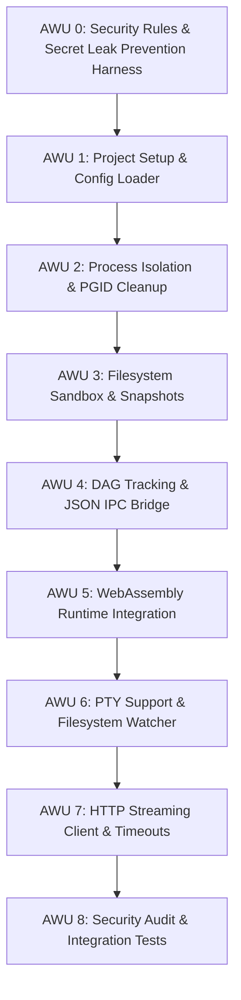

# PLANS

## Objective
Establish a comprehensive roadmap to build `rad` (Rust Agent Dispatcher) Version 0.1 as a production-ready agent runner, incorporating process isolation, filesystem safety, WebAssembly plugins, PTY support, and streaming LLM API connection.

---

## Detailed Version 0.1 Implementation Plan

### Atomic Work Units (AWUs)

* **AWU 0: Security Rules & Secret Leak Prevention Harness**
  - Define rules in `CODING_RULES.md` and `.agents/AGENTS.md` to prevent committing secrets (API keys, tokens) and local absolute paths.
  - Implement a verification script `scripts/check_secrets.sh` to scan for secrets and absolute paths.
  - Install a Git `pre-commit` hook that runs the verification script on staged changes.
  - Add the verification script run to the Strict Audit phase in `.agents/AGENTS.md`.
* **AWU 1: Project Setup & Configuration Parser**
  - Setup Cargo project structure and define core data structures.
  - Implement comments-supported (JSONC) loader merging `rad.json` and `rad.local.json`.
* **AWU 2: Process Subsystem with PGID Isolation**
  - Spawn child bash processes under dedicated PGIDs.
  - Implement a `Drop` manager to automatically force-terminate (`SIGKILL`) process groups on exit/panic.
* **AWU 3: Filesystem Subsystem, Sandbox & Snapshots**
  - Implement safe file primitives (`read`, `write`, `patch`) with normalized path capability checks.
  - Track and restore physical snapshots associated with DAG nodes under `.rad/snapshots/`.
* **AWU 4: DAG Tracking & JSON IPC Bridge**
  - Manage session history in-memory using a Directed Acyclic Graph.
  - Implement a dual-channel JSON IPC bridge mapping Core events (`RasCoreEvent`) and Extension commands.
* **AWU 5: WebAssembly Runtime Integration**
  - Embed `wasmtime` to run policy Extensions compiled as WebAssembly modules.
  - Map `RasExtensionFacingApi` primitives to host imports for the Wasm guest.
* **AWU 6: PTY Allocation & Reactive Sensors**
  - Integrate PTY (pseudoterminal) allocation to run interactive shells and capture raw terminals.
  - Implement filesystem monitoring via `notify` crate.
* **AWU 7: HTTP Streaming Client & Dynamic Timeouts**
  - Build asynchronous HTTP client supporting stream connections to OpenAI/Anthropic.
  - Implement stream monitors supporting dynamic timeout policies (`heartbeat_timeout_ms` / `max_silent_wait_ms`).
* **AWU 8: Security Audit & E2E Integration Tests**
  - Conduct path traversal prevention audit.
  - Run comprehensive integration tests verifying the full flow (Wasm Extension -> PTY command -> file edit -> snapshot -> rollback -> cleanup).
  - Verify zero Clippy warnings and test pass.
