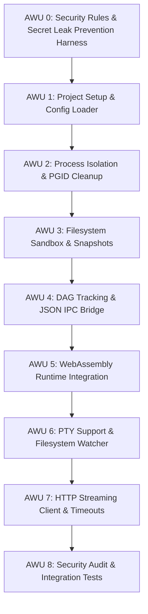
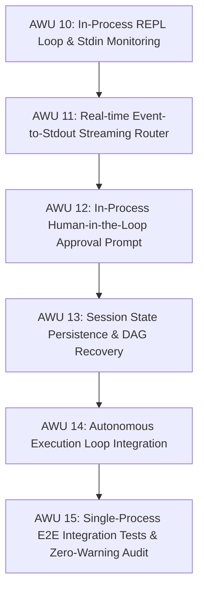
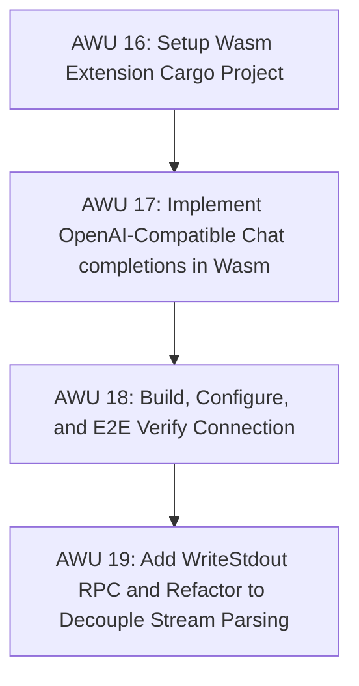
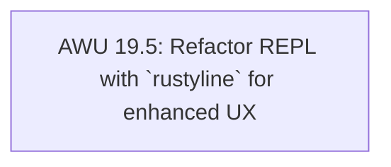
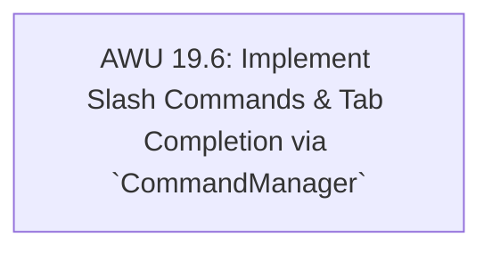

# PLANS

## Objective
Establish a comprehensive roadmap to build `rad` (Rust Agent Dispatcher) Version 0.1 as a production-ready agent runner, incorporating process isolation, filesystem safety, WebAssembly plugins, PTY support, and streaming LLM API connection.

---

## Detailed Version 0.1 Implementation Plan

### Atomic Work Units (AWUs)

* **AWU 0: Security Rules & Secret Leak Prevention Harness**
  - Define rules in `CODING_RULES.md` and `.agents/AGENTS.md` to prevent committing secrets (API keys, tokens) and local absolute paths.
  - Implement a verification script `scripts/check_secrets.sh` to scan for secrets and absolute paths.
  - Install a Git `pre-commit` hook that runs the verification script on staged changes.
  - Add the verification script run to the Strict Audit phase in `.agents/AGENTS.md`.
* **AWU 1: Project Setup & Configuration Parser**
  - Setup Cargo project structure and define core data structures.
  - Implement comments-supported (JSONC) loader merging `rad.json` and `rad.local.json`.
* **AWU 2: Process Subsystem with PGID Isolation**
  - Spawn child bash processes under dedicated PGIDs.
  - Implement a `Drop` manager to automatically force-terminate (`SIGKILL`) process groups on exit/panic.
* **AWU 3: Filesystem Subsystem, Sandbox & Snapshots**
  - Implement safe file primitives (`read`, `write`, `patch`) with normalized path capability checks.
  - Track and restore physical snapshots associated with DAG nodes under `.rad/snapshots/`.
* **AWU 4: DAG Tracking & JSON IPC Bridge**
  - Manage session history in-memory using a Directed Acyclic Graph.
  - Implement a dual-channel JSON IPC bridge mapping Core events (`RasCoreEvent`) and Extension commands.
* **AWU 5: WebAssembly Runtime Integration**
  - Add `wasmtime` (version 29 or stable equivalent compatible with edition 2024) to `Cargo.toml`.
  - Create a new module `src/wasm.rs` to manage the WebAssembly runtime execution.
  - Implement memory allocation helper methods to transfer data between host and guest.
  - Define guest functions to export (`rad_on_event`, `alloc`, `dealloc`).
  - Implement host import function `rad_host_rpc` which takes an RPC JSON request from the guest, verifies capabilities against `PermissionConfig`, forwards the command to Core subsystems (FsSandbox, ProcessManager, Dag), and returns the serialized `RasRpcResponse` back to the guest.
  - Write integration and unit tests in `src/wasm/tests.rs` (using a mock/test Wasm module or compiling a minimal Wasm guest dynamically if possible, or using a pre-compiled test Wasm bytes embedded in tests).
* **AWU 6: PTY Allocation & Reactive Sensors**
  - Integrate PTY (pseudoterminal) allocation to run interactive shells and capture raw terminals.
  - Implement filesystem monitoring via `notify` crate.
* **AWU 7: HTTP Streaming Client & Dynamic Timeouts**
  - Add asynchronous dependencies (`reqwest`, `tokio`, `futures-util`) to enable stream connection to OpenAI/Anthropic.
  - Implement dynamic timeout monitoring structure (`HttpStreamClient`) using shared state (`Arc<Mutex<TimeoutPolicy>>`) for real-time heartbeat and connection timeout.
  - Update `RunningProcess` and host RPC handling to spawn background polling threads for process stdout/stderr capture and inactivity timeout.
  - Expose `OpenHttpStream` and `SetStreamTimeoutPolicy` RPC methods, bridging streaming tokens and timeout triggers back to the Extension through `RasCoreEvent`.
* **AWU 8: Security Audit & E2E Integration Tests**
  - Conduct path traversal prevention audit.
  - Run comprehensive integration tests verifying the full flow (Wasm Extension -> PTY command -> file edit -> snapshot -> rollback -> cleanup).
  - Verify zero Clippy warnings and test pass.
* **AWU 9: GitHub Actions CI Setup**
  - Create `.github/workflows/ci.yml` to build and test the project on main target platforms (Ubuntu, macOS, Windows).
  - Enforce Rust toolchain (stable, compatible with edition 2024).
  - Run `cargo check`, `cargo clippy`, and `cargo test` on all target platforms in CI.
  - Integrate secret and absolute path check script into the workflow to ensure commit safety.

---

## Detailed Version 0.2 Implementation Plan (Single-Process Agent Shell / REPL)

### Atomic Work Units (AWUs)

* **AWU 10: In-Process REPL Loop & Stdin Monitoring**
  - Implement a terminal-based REPL loop in `src/main.rs` that defaults to showing `rad > ` when launched with no subcommands.
  - Parse CLI arguments, routing execution flow directly into the interactive REPL.
* **AWU 11: Real-time Event-to-Stdout Streaming Router**
  - Route Wasm Extension events (like `TokenReceived` and process execution stdout/stderr) directly to the active terminal's stdout/stderr in real-time.
  - Ensure zero network socket overhead by executing Wasm and OS primitives within the same single process.
* **AWU 12: In-Process Human-in-the-Loop Approval Prompt**
  - Intercept privileged RPC commands (e.g. executing commands, writing files) to request manual confirmation.
  - Present approval requests directly on the active terminal (`Approve? (y/n): `) and halt execution synchronously until the user responds.
* **AWU 13: Session State Persistence & DAG Recovery**
  - Implement JSON serialization for DAG state.
  - Save sessions to `.rad/sessions/` on changes and add support for reloading session on startup via CLI (e.g. `rad --session <session_id>`).
* **AWU 14: Autonomous Execution Loop Integration**
  - Integrate orchestrator loop inside the REPL thread, ensuring LLM calls keep running autonomously until task goal is met or human interaction is triggered.
* **AWU 15: Single-Process E2E Integration Tests & Zero-Warning Audit**
  - Add comprehensive E2E tests validating the REPL flow (startup -> stdin task -> auto stream output -> human approval -> completion).
  - Run clippy, tests, secret checks, and achieve zero warning status.

---

## Version 0.2.1 OpenAI-Compatible Wasm Extension (openai-orchestrator)

### Atomic Work Units (AWUs)

* **AWU 16: Setup Wasm Extension Cargo Project**
  - Create a new directory `ext/openai-orchestrator/` containing a Rust library project.
  - Configure `Cargo.toml` with `crate-type = ["cdylib"]` and dependency settings for parsing JSON and calling host imports (`rad_host_rpc`).
* **AWU 17: Implement OpenAI-Compatible Chat completions in Wasm**
  - Implement memory allocator functions (`alloc`, `dealloc`) and event handler (`rad_on_event`) in Wasm guest.
  - Implement state machine in Wasm that receives user task input (`HumanInputReceived`), constructs the chat history payload, and initiates the streaming chat completions request to `/v1/chat/completions` using the `OpenHttpStream` RPC command.
  - Parse returning LLM tokens and tool call requests, dispatching subsequent file/process operations back to the Core host.
* **AWU 18: Build, Configure, and E2E Verify Connection**
  - Compile the extension to Wasm (`wasm32-wasip1` or `wasm32-unknown-unknown`).
  - Copy or point the `rad.json` configuration `"source"` directly to the compiled `.wasm` file.
  - Verify `rad` successfully runs, connects to the local endpoint, prints the streaming output, prompts for approvals, and completes tasks.
* **AWU 19: Add WriteStdout RPC and Refactor to Decouple Stream Parsing**
  - Add `WriteStdout` command to `RasRpcCommand` to let Wasm write parsed text directly to the console.
  - Refactor `http.rs` to send raw streaming data under a new event type `HttpChunkReceived` and stop `Orchestrator` from printing this raw data automatically.
  - Update `openai-orchestrator` in Wasm to receive `HttpChunkReceived` instead of `TokenReceived`, parse the raw SSE format, extract the content delta, and call the new `WriteStdout` RPC to display text in the terminal.

---

## Version 0.2.1.5 Enhanced REPL UX (via `rustyline`)

### Atomic Work Units (AWUs)

* **AWU 19.5: Refactor REPL with `rustyline` for enhanced UX**
  - Add `rustyline` to `Cargo.toml` to support command history and advanced line editing.
  - Refactor the interactive loop in `src/main.rs` to use `rustyline` instead of simple `stdin` reading.
  - Implement prompt management logic to ensure the `rustyline` prompt and real-time streaming output (from AWU 19) coexist without visual artifacts (e.g., by clearing/re-printing the prompt).

## Version 0.2.1.6 Slash Commands & Tab Completion (via `rustyline`)

### Atomic Work Units (AWUs)

* **AWU 19.6: Implement Slash Commands & Tab Completion via `CommandManager`**
  - Create `src/command.rs` to host the `Command` enum, `CommandParser`, `CommandExecutor`, and `CommandResponse`.
  - Implement `CommandParser` to identify slash commands (e.g., `/help`, `/exit`, `/status`) and provide fallback for non-command inputs.
  - Implement `CommandCompleter` using the `rustyline::completion::Completer` trait to provide tab-completion for slash commands.
  - Refactor `src/main.rs` to delegate slash commands to `CommandManager` and regular tasks to `Orchestrator`.
  - Ensure integration with `rustyline`'s `DefaultEditor` for seamless completion and command execution.
  - Verify compliance with clippy, check_secrets.sh, and cargo test.

